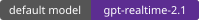
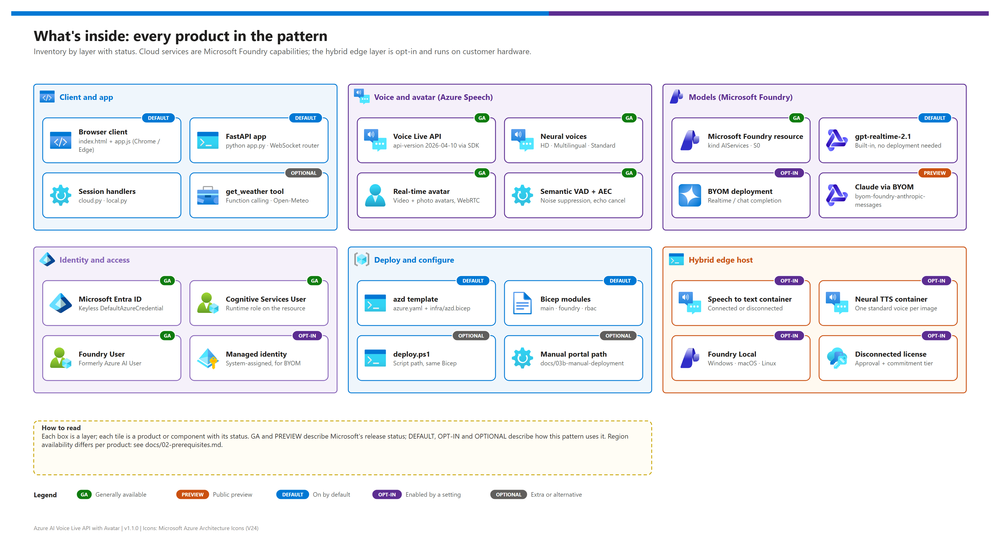

# Azure AI Voice Live API with Avatar

<p align="center">
  &nbsp;
  &nbsp;
  &nbsp;
  &nbsp;
  &nbsp;
  &nbsp;
  
</p>

<p align="center">
  
  
  
  
  
  
  
</p>

A reusable, pro-code reference for a **real-time AI voice assistant with a lifelike avatar**. One FastAPI process bridges the browser to the [Azure AI Voice Live API](https://learn.microsoft.com/azure/ai-services/speech-service/voice-live), which fuses speech recognition, a realtime model (built-in `gpt-realtime-2.1` or your own via BYOM), neural / HD voices and the [real-time text to speech avatar](https://learn.microsoft.com/azure/ai-services/speech-service/text-to-speech-avatar/what-is-text-to-speech-avatar) behind one WebSocket. Function calling, keyless Entra ID auth, a one-command `azd up` for the Azure side, and an **opt-in on-prem fallback** (Speech containers + Foundry Local) for sites with unreliable connectivity are included. It is written for architects, developers and presenters who need a working demo they can retarget with configuration only.

> [!NOTE]
> **Start here.** First time? Follow [00 — Reproduce this demo](./docs/00-reproduce-this-demo.md). Want the design first? Read [01 — Architecture](./docs/01-architecture.md). Version 1.1.0 retrofits the docs to the visual standard, adds the `azd` template and refreshes every Microsoft Learn claim (snapshot **2026-10-07**, see [`CHANGELOG.md`](./CHANGELOG.md)). The retrofit was validated statically; the live test matrix in [04 — Testing](./docs/04-testing.md) still has to be re-run on Azure.

## At a glance

| | Topic | One-line answer |
|---|---|---|
|  | **What it is** | Browser ↔ FastAPI ↔ Voice Live API, with the avatar streamed to the browser over WebRTC |
|  | **Model** | `gpt-realtime-2.1` built into Voice Live (no deployment); BYOM for your own deployments  |
|  | **Azure footprint** | One resource group + one Microsoft Foundry resource (`AIServices`, S0) + two role assignments |
|  | **Offline story** | Opt-in voice-only fallback on an edge host: Speech containers + Foundry Local  |
|  | **Deploy** | `azd up` (tenant-guarded hooks), `infra/deploy.ps1`, or the portal path  |
|  | **Retarget** | `.env` + `SYSTEM_PROMPT` in `config.py` — see [07 — Configuration reference](./docs/07-configuration-reference.md) |

## What this pattern delivers

[](./docs/assets/ai-voice-live-avatar-architecture.png)

<sub>Editable source: [`docs/assets/ai-voice-live-avatar-architecture.drawio`](./docs/assets/ai-voice-live-avatar-architecture.drawio) — regenerate with `python scripts/export_diagrams.py docs/assets`.</sub>

- **Avatar mode** — WebRTC-streamed standard video avatars (Lisa, Harry, Lori, Max, Meg, Rowan, …) and photo avatars.
- **Voice-only mode** — the same conversation without avatar video (faster to start, cheaper).
- **Voice and text input** — 24 kHz PCM16 mic capture via AudioWorklet; server-side noise suppression, echo cancellation and semantic turn detection.
- **Voices** — Azure HD (`DragonHDLatestNeural`), Multilingual and Standard neural voices, chosen per session.
- **Proactive greeting** — the assistant speaks first (English by default, configurable in `SYSTEM_PROMPT`).
- **BYOM** — point Voice Live at your own Foundry deployment (realtime, chat completion, or Claude via `byom-foundry-anthropic-messages` ).
- **Function calling** — optional `get_weather` tool with browser geolocation.
- **Hybrid local fallback** — sessions continue voice-only on-prem when the cloud is unreachable (per-session decision, orange `LOCAL` badge).
- **Keyless auth** — `DefaultAzureCredential` (Azure CLI on a dev box, managed identity in production).

## What's inside

<table>
  <tr>
    <td align="center" width="25%"><br><b>Voice Live API</b><br><sub>Speech-to-speech over one WebSocket.</sub></td>
    <td align="center" width="25%"><br><b>Real-time avatar</b><br><sub>Video + photo avatars over WebRTC.</sub></td>
    <td align="center" width="25%"><br><b>gpt-realtime-2.1</b><br><sub>Built-in default model.</sub></td>
    <td align="center" width="25%"><br><b>BYOM</b><br><sub>Your own Foundry deployment.</sub></td>
  </tr>
  <tr>
    <td align="center" width="25%"><br><b>Entra ID + RBAC</b><br><sub>Cognitive Services User + Foundry User.</sub></td>
    <td align="center" width="25%"><br><b>FastAPI app</b><br><sub>WebSocket router + session handlers.</sub></td>
    <td align="center" width="25%"><br><b>Speech containers</b><br><sub>Opt-in on-prem STT + neural TTS.</sub></td>
    <td align="center" width="25%"><br><b>Foundry Local</b><br><sub>Opt-in on-device LLM.</sub></td>
  </tr>
</table>

[](./docs/assets/service-catalog.png)

<sub>Editable source: [`docs/assets/service-catalog.drawio`](./docs/assets/service-catalog.drawio).</sub>

## Choose a mode and a deployment path

| | Cloud mode (Voice Live) | Local fallback mode (edge host) |
|---|---|---|
| **Status** |   |  (this repo's MVP) |
| **Avatar** | ✅ real-time avatar over WebRTC | ❌ voice-only by design |
| **Voices** | HD, Multilingual, Standard | One standard voice per NTTS image |
| **Turn detection** | Azure semantic VAD + barge-in | Energy VAD (`LOCAL_VAD_*`) |
| **Function calling** | ✅ | ❌ not in the MVP |
| **First audio (indicative)** | ~0.5–1.0 s | ~2–4 s, GPU-dependent |
| **Recommendation** | **Default for every demo** | Only for sites with unreliable connectivity |

| Deployment path | Best for | Doc |
|---|---|---|
|  **`azd up`** | One command, tenant-guarded hooks, writes `.env` for you | [03 — Deployment § Fast path](./docs/03-deployment.md#fast-path--azd-up) |
| **`infra/deploy.ps1`** | Same Bicep from a script / pipeline | [03 — Deployment § Script path](./docs/03-deployment.md#phase-1--script-path-infradeployps1) |
|  **Portal / az CLI** | Workshops, no-IaC environments | [03b — Manual deployment](./docs/03b-manual-deployment.md) |
| **Recommendation** | Use **`azd up`** unless policy forbids IaC | |

## Quick start

| Step | | Action | Gate |
|---|---|---|---|
| **0** |  | `az login --tenant <tenant-id>` · `az account set --subscription <subscription-id>` · `azd auth login --tenant-id <tenant-id>` | ☐ `az account show` shows the intended tenant + subscription |
| **1** |  | `azd env new <name>` · `azd env set AZURE_TENANT_ID …` · `AZURE_SUBSCRIPTION_ID …` · `AZURE_LOCATION eastus2` | ☐ `azd env get-values` shows all three |
| **2** |  | `azd up` | ☐ Hooks pass; `.env` has `AZURE_AI_ENDPOINT` |
| **3** |  | `python -m venv .venv` · activate · `pip install -r requirements.txt` · `python app.py` | ☐ `curl http://localhost:8000/api/health` → `"status":"ok"` |
| **4** |  | Open <http://localhost:8000> in Chrome or Edge → **Start Avatar** | ☐ Avatar appears and greets you |

<details><summary><b>Show the commands</b></summary>

```pwsh
az login --tenant <tenant-id>
az account set --subscription <subscription-id>
azd auth login --tenant-id <tenant-id>

azd env new voice-avatar-dev
azd env set AZURE_TENANT_ID <tenant-id>
azd env set AZURE_SUBSCRIPTION_ID <subscription-id>
azd env set AZURE_LOCATION eastus2
azd up                                   # preprovision guard -> Bicep -> postprovision writes .env

python -m venv .venv
. .\.venv\Scripts\Activate.ps1           # macOS/Linux: . ./.venv/bin/activate
pip install -r requirements.txt
python app.py                            # http://localhost:8000
```

</details>

> [!WARNING]
> **Never run a bare `az login` / `azd up`.** The Azure CLI and azd keep separate, drifting logins; the `preprovision` hook stops unless `az account show` matches `AZURE_TENANT_ID` / `AZURE_SUBSCRIPTION_ID`. Already have a Foundry resource? Skip azd: copy `.env.example` to `.env`, set `AZURE_AI_ENDPOINT`, and grant yourself the two roles ([03b](./docs/03b-manual-deployment.md)).

## Prerequisites snapshot

| Requirement | Details |
|---|---|
| Azure subscription | Owner, or Contributor + User Access Administrator, on the target scope |
| Region | Tier 1: `eastus2`, `westus2`, `swedencentral`, `southeastasia`, `centralindia`, `eastus` (full feature set) — [02 § 1.3](./docs/02-prerequisites.md#13-regional-availability-matrix) |
| Runtime roles | **Cognitive Services User** + **Foundry User** (formerly *Azure AI User*) on the Foundry resource |
| Tools | Python 3.10+, Azure CLI 2.60+, Azure Developer CLI, PowerShell 7+, Chrome / Edge 120+ |
| Hybrid only | Edge host with Docker; Foundry Local; Foundry resource key for container metering |

## When to use this pattern

| Use this pattern when | Use something else when |
|---|---|
| You want a production-style real-time voice + avatar experience on Voice Live | You need knowledge-base / RAG answers over a document corpus → a RAG knowledge-base pattern |
| You need a working reference for Voice Live + avatar + neural voices in one FastAPI + browser pair | You need multi-agent orchestration → add Foundry Agent Service above this app |
| You want BYOM wired up without writing the connection plumbing | You need a **fully air-gapped** avatar experience — no on-prem avatar or realtime model exists |
| Sites have intermittent internet and need graceful, voice-only degradation | You want to compare Voice Live with the Realtime API → a dedicated comparison pattern |

> [!TIP]
> The pattern is domain-neutral: the assistant's persona, greeting language and tools live in `SYSTEM_PROMPT` (`config.py`) and `.env`. Retargeting it to another scenario is a configuration change — see [01 § Adapting this pattern](./docs/01-architecture.md#adapting-this-pattern-to-another-scenario).

## File index

| Path | Purpose |
|---|---|
| `app.py` | FastAPI server, WebSocket router, per-session hybrid routing, `/api/*` endpoints |
| `session_handlers/` | `SessionHandler` protocol + cloud (`cloud.py`) and local (`local.py`) handlers |
| `local_clients/` | Async clients for the Speech containers and Foundry Local |
| `connectivity.py` · `config.py` · `voice_handler.py` | Cloud reachability supervisor · settings from the environment · back-compat shim |
| `static/` · `templates/` | Browser client (WebRTC, AudioWorklet, UI) and the single-page template |
| `docker-compose.local.yml` | On-prem Speech STT + neural TTS containers (hybrid path) |
| `azure.yaml` · `infra/` | azd template (`azd.bicep`, `azd.parameters.json`, `hooks/`) over the shared `main.bicep` + modules + `deploy.ps1` |
| `docs/` | **All narrative docs** (00–07) plus `docs/hybrid/` supplements and `docs/assets/` (diagrams, icons, badges) |
| `scripts/` · `tests/` · `.github/workflows/validate.yml` | `export_diagrams.py`, `lint_doc_visuals.py`, `make_badges.py` · doc, configuration and azd guard tests · static CI (tests, strict lint, Bicep compile) |
| `demo-ids.template.json` | Shape of the gitignored `demo-ids.local.json` written after a deployment |

| Doc | What it answers |
|---|---|
| [00 — Reproduce this demo](./docs/00-reproduce-this-demo.md) | One continuous walkthrough, parts A–F with checkpoints |
| [01 — Architecture](./docs/01-architecture.md) | Layers, request path, modes, trust boundaries, locked decisions |
| [02 — Prerequisites](./docs/02-prerequisites.md) | Roles, regions × features, cost model, hybrid hardware, pre-flight |
| [03 — Deployment](./docs/03-deployment.md) · [03b — Manual](./docs/03b-manual-deployment.md) | azd / script / portal paths with validation gates |
| [04 — Testing](./docs/04-testing.md) · [05 — Troubleshooting](./docs/05-troubleshooting.md) | Test matrix + demo script · triage table and fixes |
| [06 — Hybrid local fallback](./docs/06-hybrid-local-fallback.md) · [07 — Configuration](./docs/07-configuration-reference.md) | The on-prem path end to end · every setting in one page |

## Distribution

This repo is designed to be pushed to GitHub or Azure DevOps as-is:

| Rule | How it's enforced |
|---|---|
| No secrets, keys or populated IDs in git | `.gitignore` excludes `.env`, `.env.*` (except `.env.example`), `.azure/`, `demo-ids.local.json`, `*.local.json`, `*.pem`, `*.key` |
| Runtime values come from the environment | The app reads `.env` / process environment; pipelines use variable groups or Key Vault, never `demo-ids.*.json` |
| IDs after a deployment | `demo-ids.local.json` (gitignored) is written by the `postprovision` hook or `deploy.ps1`; `demo-ids.template.json` documents its shape |
| Docs stay shareable | `python scripts/lint_doc_visuals.py --strict` and `tests/` run before every publish |

> [!CAUTION]
> The Foundry resource key is only needed by the optional Speech containers (`SPEECH_API_KEY`). Keep it in a site secret store or a `.env` next to `docker-compose.local.yml` with restricted permissions — never in git, never in docs.

## Decision provenance

| Decision area | Where it's recorded |
|---|---|
| Voice Live as the single cloud orchestrator; `gpt-realtime-2.1` default (moved from `gpt-realtime` in v1.1.0 because the 2025-08-28 version retires 2027-03-02) | [01 § Locked design decisions](./docs/01-architecture.md#locked-design-decisions) · [`CHANGELOG.md`](./CHANGELOG.md) |
| Hybrid Approach A (cloud-primary + voice-only fallback) over B (local-first) and C (tools-only) | [`docs/hybrid/customer-report.md`](./docs/hybrid/customer-report.md) |
| MVP engineering scope and out-of-scope items | [`docs/hybrid/implementation-plan.md`](./docs/hybrid/implementation-plan.md) |
| What must stay in Azure vs. what can move on-prem | [`docs/hybrid/azure-vs-onprem-responsibility.md`](./docs/hybrid/azure-vs-onprem-responsibility.md) |
| Model choice, BYOM profiles, local LLM substitutes | [`docs/hybrid/model-selection.md`](./docs/hybrid/model-selection.md) |
| Engagement-specific context (originating engagement, stakeholders) | Kept in the owner's private engagement notes, not in this repo |

## License

| License | Scope |
|---|---|
| MIT | Code and docs in this repo. Microsoft product icons in `docs/assets/icons/` follow the [Azure architecture icon terms](./docs/assets/icons/README.md). |

---

Next: [00 — Reproduce this demo](./docs/00-reproduce-this-demo.md) →

*Last updated: 2026-10-07*
