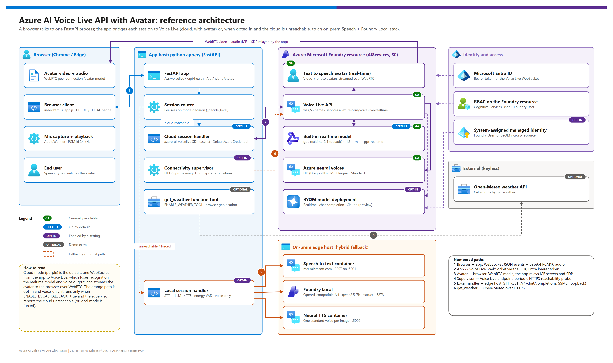
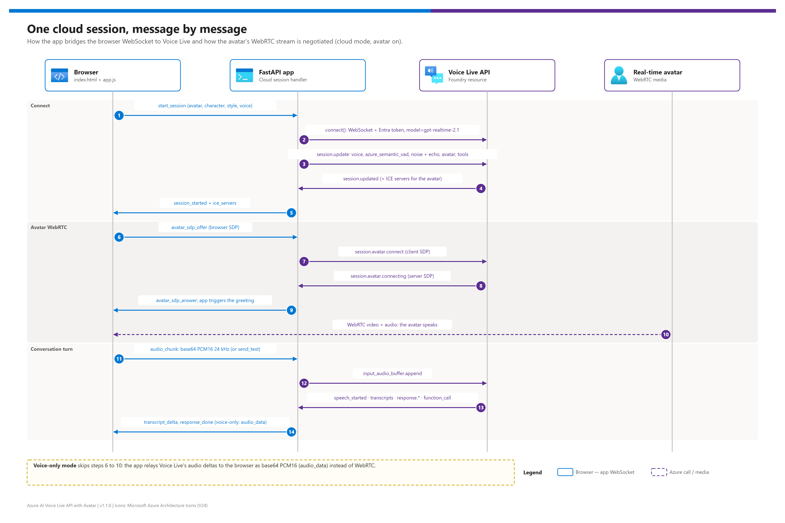
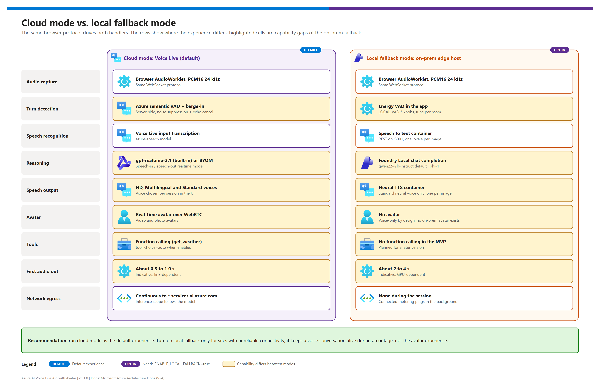

[README](../README.md) › [docs index](./00-reproduce-this-demo.md) › 01 Architecture

# 01 — Architecture

<p>
&nbsp;
&nbsp;
&nbsp;
&nbsp;
&nbsp;
&nbsp;

</p>

   

The reference architecture for **Azure AI Voice Live API with Avatar**: which component does what, how one session flows message by message, how the opt-in local fallback differs from the cloud path, where the trust boundaries are, and which design decisions are locked. Read it before [02 — Prerequisites](./02-prerequisites.md); it stands on its own for architecture reviews.

## At a glance

| | Topic | One-line answer |
|---|---|---|
|  | **Shape** | One FastAPI process per site; the browser never talks to Azure directly except for avatar media |
|  | **Orchestrator** | Voice Live API fuses recognition, the realtime model, voices and the avatar behind one WebSocket |
|  | **Avatar media** | WebRTC from the avatar service to the browser; the app only relays ICE servers and SDP |
|  | **Identity** | `DefaultAzureCredential`; roles **Cognitive Services User** + **Foundry User** |
|  | **Fallback** | Per-session, opt-in, voice-only: STT container → Foundry Local → neural TTS container |
|  | **Reuse** | Persona, model, voices, avatars and tools are configuration ([07](./07-configuration-reference.md)) |

## Goals and non-goals

| Goals | Non-goals |
|---|---|
| Real-time voice + avatar UX on Voice Live with the `gpt-realtime` family and WebRTC avatar video | Multi-tenant SaaS: this is a single-instance app; add a reverse proxy + auth for multi-user production |
| A small application surface: one FastAPI process, one single-page client, no orchestration framework | RAG over a document corpus or structured extraction (use a knowledge-base pattern) |
| Graceful degradation: sessions survive a cloud outage voice-only on an edge host | An on-prem avatar or on-prem realtime model (none exists — see [`hybrid/azure-vs-onprem-responsibility.md`](./hybrid/azure-vs-onprem-responsibility.md)) |
| Everything per-environment configurable: endpoint, model, voice, avatar, feature flags | Custom orchestration layers (LangChain, Semantic Kernel workflows): Voice Live *is* the orchestrator |

## Reference architecture

[](./assets/ai-voice-live-avatar-architecture.png)

<sub>Editable source: [`assets/ai-voice-live-avatar-architecture.drawio`](./assets/ai-voice-live-avatar-architecture.drawio) — regenerate with `python scripts/export_diagrams.py docs/assets`.</sub>

| Tier | Component | Role |
|---|---|---|
|  **Browser** | `templates/index.html`, `static/js/app.js`, `static/js/audio-processor.js`, `static/css/style.css` | UI, 24 kHz PCM16 mic capture (AudioWorklet), audio playback, WebRTC peer for the avatar, CLOUD / LOCAL mode badge |
|  **App host** | `app.py`, `session_handlers/`, `local_clients/`, `connectivity.py`, `weather_service.py` | WebSocket router, per-session handler choice, Voice Live SDK calls, REST calls to the edge host, reachability probe, optional `get_weather` tool |
|  **Azure** | Microsoft Foundry resource: Voice Live, real-time avatar, neural / HD voices, optional BYOM deployment | Recognition, realtime reasoning, voice output, semantic VAD, noise suppression, echo cancellation, avatar rendering |
|  **Identity** | Entra ID, RBAC on the Foundry resource, system-assigned managed identity | Keyless tokens for the app; the resource identity reaches BYOM deployments |
|  **Edge host** (opt-in) | `speech-to-text` container, `neural-text-to-speech` container, Foundry Local | Equivalent STT / LLM / TTS for the voice-only fallback |

## Request path

[](./assets/realtime-session-sequence.png)

<sub>Editable source: [`assets/realtime-session-sequence.drawio`](./assets/realtime-session-sequence.drawio).</sub>

| Step | | What happens | Where in the code |
|---|---|---|---|
| **1–2** |  | The browser sends `start_session`; the cloud handler calls `connect()` with an Entra token and `model=VOICE_LIVE_MODEL` (or the BYOM deployment + `profile=`) | `app.py`, `session_handlers/cloud.py` `start()` |
| **3–5** |  | `session.update` sets the voice, `azure_semantic_vad`, `azure_deep_noise_suppression`, `server_echo_cancellation`, avatar and tools; `session.updated` returns ICE servers | `cloud.py` `_setup_session()` |
| **6–10** |  | The browser offers SDP, the app relays it as `session.avatar.connect`, returns the server SDP, and the avatar streams over WebRTC; the greeting starts after the avatar connects | `cloud.py` `send_avatar_sdp_offer()`, `static/js/app.js` |
| **11–14** |  | Mic audio is appended to the input buffer; Voice Live returns speech events, transcripts, responses and function calls, which the app forwards to the browser | `cloud.py` `_process_events()` |

> [!NOTE]
> Microsoft Learn recommends the [Voice Live WebRTC transport](https://learn.microsoft.com/azure/ai-services/speech-service/voice-live-webrtc) for most client-side apps. This pattern deliberately uses the server-side WebSocket via the `azure-ai-voicelive` SDK so the browser never holds a token and the app can route sessions to the local fallback; only the avatar's media uses WebRTC.

## Cloud mode vs. local fallback mode

[](./assets/session-modes-comparison.png)

<sub>Editable source: [`assets/session-modes-comparison.drawio`](./assets/session-modes-comparison.drawio).</sub>

Both handlers implement the same `SessionHandler` protocol and the same browser event protocol (additive only: a `mode` field on `session_started` and a `mode_notice` message), so the UI is identical apart from the mode badge and the hidden avatar pane. How a new session picks its handler is drawn in [06 — Hybrid local fallback](./06-hybrid-local-fallback.md#session-routing).

## Components

| Component | File / image | Notes |
|---|---|---|
|  FastAPI app | `app.py` | WebSocket endpoint `/ws/voicelive`, static UI, `/api/health`, `/api/avatars`, `/api/hybrid/status` |
|  Cloud handler | `session_handlers/cloud.py` | Wraps the async `azure-ai-voicelive` SDK: session lifecycle, avatar SDP relay, function-call routing |
|  Local handler | `session_handlers/local.py` | STT → LLM → TTS with energy VAD and barge-in; voice-only |
|  Connectivity supervisor | `connectivity.py` | Background HTTPS probe of `AZURE_AI_ENDPOINT`; flips to unreachable after `FAILOVER_FAILURE_THRESHOLD` failures |
|  Local clients | `local_clients/{stt,tts,llm}.py` | REST for STT / neural TTS; OpenAI-compatible client for Foundry Local |
|  Speech STT container | `mcr.microsoft.com/azure-cognitive-services/speechservices/speech-to-text` | Connected or disconnected metering; about 4 vCPU / 4 GB RAM |
|  Neural TTS container | `mcr.microsoft.com/azure-cognitive-services/speechservices/neural-text-to-speech:<voice-tag>` | One image per voice; about 6 vCPU / 12 GB RAM; standard neural voices only (no HD) |
|  Foundry Local | `winget install Microsoft.FoundryLocal` (Windows), `brew install foundrylocal` (macOS), Linux supported | OpenAI-compatible `/v1/chat/completions`; vLLM works as an alternative |

## Data flow

### Cloud mode (default)

```
mic ─base64 PCM16─▶ App ─WebSocket─▶ Azure Voice Live ─▶ real-time avatar
                                                      ─▶ HD / Standard voices
                                                      ─▶ gpt-realtime-2.1 (or BYOM)
              audio + transcripts ◀── Voice Live ◀── (same events)
              video frames        ◀── avatar service via WebRTC
```

User audio crosses the public internet to the Foundry resource. Azure Speech stores and processes speech data in the resource's region, but **for Voice Live the model inference location follows the model you pick**: global (`gpt-realtime-2.1`), data zone (`…-datazone`) or regional (`…-regional`) — see [Voice Live region support](https://learn.microsoft.com/azure/ai-services/speech-service/regions?tabs=voice-live).

### Local-fallback mode

```
mic ─base64 PCM16─▶ App (edge host) ─HTTP─▶ Speech STT container (loopback)
                                       ─HTTP─▶ Foundry Local (loopback)
                                       ─HTTP─▶ neural TTS container (loopback)
              audio + transcripts ◀── App ◀── (assembled locally)
```

Audio never leaves the edge host. Outbound during a session: zero (connected container metering is a periodic background ping, not per request).

> [!IMPORTANT]
> Data residency is a **model choice**, not only a region choice. If prompts and responses must stay in a geography, set `VOICE_LIVE_MODEL` to a `-datazone` or `-regional` variant that the region offers (check the Voice Live tab of the regions page), and document that choice for the compliance team.

## Trust boundaries

| Boundary | Notes |
|---|---|
| Browser ↔ App | WebSocket. The browser only sends `start_session`, `audio_chunk`, `send_text`, `interrupt`, `stop_session` and `avatar_sdp_offer`; the app emits the events handled in `static/js/app.js` |
| App ↔ Azure | `DefaultAzureCredential` (Azure CLI or managed identity) → Voice Live WebSocket with a bearer token. RBAC: **Cognitive Services User** + **Foundry User** on the Foundry resource |
| Foundry resource ↔ BYOM deployment | The resource's system-assigned identity needs **Foundry User** on the model's resource for `byom-azure-openai-chat-completion`, `byom-foundry-anthropic-messages` and any cross-resource override |
| App ↔ edge containers | Plain HTTP on the site LAN by default; keep everything on one host (loopback) or add a reverse proxy + mTLS |
| App ↔ Foundry Local | Loopback only, no authentication |
| Edge containers ↔ Azure | Connected metering; replaced by a license-file mount for disconnected operation |

## Locked design decisions

| # | Decision | Choice | Rationale |
|---|---|---|---|
| 1 | Cloud orchestration | Voice Live API as the single fused orchestrator | Bundles ASR + LLM + TTS + semantic VAD + barge-in + tools behind one WebSocket; minimal orchestration code |
| 2 | Cloud model | `gpt-realtime-2.1` by default; `gpt-realtime-1.5`, `-mini` and `gpt-realtime` via `VOICE_LIVE_MODEL` | Speech-in / speech-out with the lowest latency. v1.1.0 moved the default off `gpt-realtime` because its 2025-08-28 version retires on 2027-03-02 ([retirement schedule](https://learn.microsoft.com/azure/foundry/openai/concepts/model-retirement-schedule)); `gpt-realtime-2.1` is  (2026-07-07) and retires 2027-06-25. See [`hybrid/model-selection.md`](./hybrid/model-selection.md) |
| 3 | Avatar rendering | Real-time text to speech avatar via WebRTC | The only Microsoft-supported real-time avatar; no on-prem equivalent |
| 4 | Voice tier | HD voices preferred; Multilingual / Standard as fallbacks | Most natural prosody; Standard neural voices are the ones available on-prem |
| 5 | Identity | `DefaultAzureCredential` (keyless) | The same chain works for `az login` on dev boxes and managed identity in production |
| 6 | Fallback granularity | Per session, not mid-session | A mid-session swap would need conversation replay; per-session is cheap and predictable |
| 7 | Local LLM | Foundry Local (or vLLM) serving `qwen2.5-7b-instruct` (default) or `phi-4` | No on-prem realtime model exists; closest OpenAI-compatible experience |
| 8 | Local TTS voice | Standard neural voice in the container (default `en-US-JennyNeural`) | HD voices are not in the container catalog |
| 9 | Local VAD | Energy-based, in-process | Semantic VAD has no on-prem equivalent; tuneable via `LOCAL_VAD_*` |
| 10 | Browser protocol | Additive changes only | Cloud and local share one protocol; the UI differs only by badge and avatar pane |

See [`hybrid/options-analysis.md`](./hybrid/options-analysis.md) for the comparative analysis behind decisions 6–9 and [`hybrid/implementation-plan.md`](./hybrid/implementation-plan.md) for the engineering plan.

## Adapting this pattern to another scenario

The shipped assistant is a friendly, general-purpose avatar host. Nothing in the code is domain-specific; retargeting is configuration:

| Change | Where | Notes |
|---|---|---|
| Persona, tone, greeting language | `SYSTEM_PROMPT` in `config.py` | The only prose that describes the assistant; keep replies short because they are spoken |
| Model | `VOICE_LIVE_MODEL`, or `ENABLE_BYOM_MODE` + `VOICE_BYOM_MODE` + `VOICE_BYOM_MODEL` | Check the region offers the model; BYOM for tuned or PTU deployments |
| Default avatar and voice | `DEFAULT_VIDEO_CHARACTER`, `DEFAULT_PHOTO_CHARACTER`, `DEFAULT_VOICE` | Must exist in `AVATAR_CHARACTERS` / `PHOTO_AVATARS` / `VOICES` in `config.py` |
| Tools | `ENABLE_WEATHER_TOOL`; add tools next to `WEATHER_TOOL` in `session_handlers/cloud.py` | Tool name + description decide when the model calls it — keep them neutral and specific |
| Region, names, roles | azd environment (`AZURE_LOCATION`, `WORKLOAD_PREFIX`, `DEMO_ENVIRONMENT`, `ADDITIONAL_PRINCIPAL_IDS`) | See [07 — Configuration reference](./07-configuration-reference.md) |

What stays fixed: the session protocol, the handler split, the Bicep shape (one Foundry resource + RBAC), and the per-session fallback rule. Add domain-specific fields only as new tools or prompt text — never by forking the handlers.

> [!TIP]
> Want to show grounded answers over your own content? Keep this app as the voice + avatar front end and add a retrieval tool (for example, an Azure AI Search query) as a function — the VoiceRAG pattern Microsoft Learn describes for Voice Live function calling.

## Microsoft Learn references

| Topic | Link |
|---|---|
| Voice Live overview, supported models, pricing tiers | <https://learn.microsoft.com/azure/ai-services/speech-service/voice-live> |
| Voice Live how-to (endpoint, `api-version=2026-04-10`, session properties) | <https://learn.microsoft.com/azure/ai-services/speech-service/voice-live-how-to> |
| Bring your own model (BYOM) | <https://learn.microsoft.com/azure/ai-services/speech-service/how-to-bring-your-own-model> |
| Regions (Voice Live, real-time avatar, HD voices) | <https://learn.microsoft.com/azure/ai-services/speech-service/regions> |
| Text to speech avatar | <https://learn.microsoft.com/azure/ai-services/speech-service/text-to-speech-avatar/what-is-text-to-speech-avatar> |
| Model retirement schedule | <https://learn.microsoft.com/azure/foundry/openai/concepts/model-retirement-schedule> |

---

Next: [02 — Prerequisites](./02-prerequisites.md) →

*Last updated: 2026-10-07*
