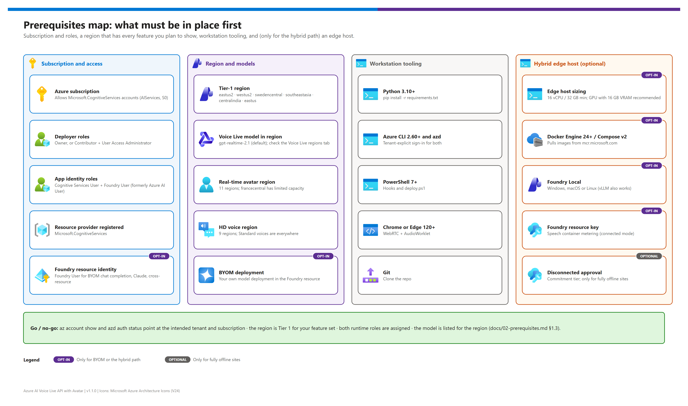
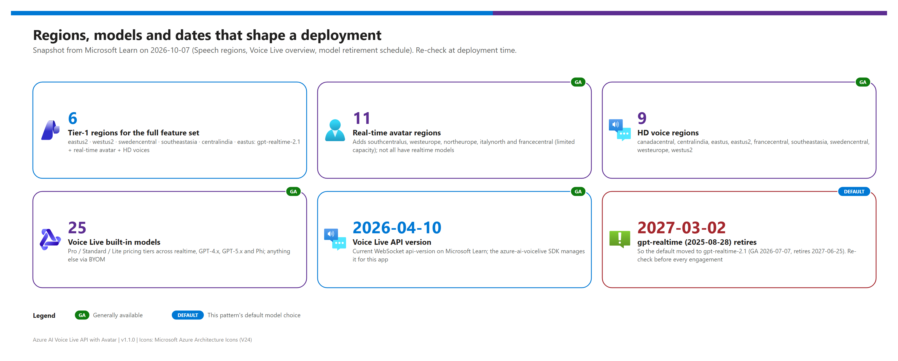

[README](../README.md) › [docs index](./00-reproduce-this-demo.md) › 02 Prerequisites

# 02 — Prerequisites

<p>
&nbsp;
&nbsp;
&nbsp;
&nbsp;
&nbsp;
&nbsp;

</p>

   

Everything that must be in place before you deploy: subscription and roles, a region that has every feature you plan to show, the cost model, workstation tooling and — only for the hybrid path — an edge host. Section 1 is always required; section 2 adds the optional on-prem fallback. The pre-flight checklist at the end is the go / no-go for [03 — Deployment](./03-deployment.md).

## At a glance

| | Topic | One-line answer |
|---|---|---|
|  | **Deployer roles** | Owner, or Contributor + User Access Administrator, on the subscription (or target resource group) |
|  | **Runtime roles** | **Cognitive Services User** + **Foundry User** (formerly *Azure AI User*) on the Foundry resource |
|  | **Region** | Tier 1 = `eastus2`, `westus2`, `swedencentral`, `southeastasia`, `centralindia`, `eastus` |
|  | **Model** | `gpt-realtime-2.1` is built into Voice Live — no model deployment needed  |
|  | **Hybrid** | 16 vCPU / 32 GB edge host minimum, GPU recommended, Docker, Foundry Local  |

## Prerequisites map

[](./assets/prerequisites-map.png)

<sub>Editable source: [`assets/prerequisites-map.drawio`](./assets/prerequisites-map.drawio) — regenerate with `python scripts/export_diagrams.py docs/assets`.</sub>

## 1. Always required — cloud path

### 1.1 Azure

| Resource | Notes |
|---|---|
|  **Azure subscription** | Deployer needs **Owner**, or **Contributor** + **User Access Administrator** (the Bicep creates role assignments) |
|  **Microsoft Foundry resource** (`kind=AIServices`, S0) | Hosts Voice Live, the real-time avatar, neural voices and optional BYOM deployments under one custom-domain endpoint `https://<name>.services.ai.azure.com` |
|  **Region** | Must offer every feature you plan to show — see [§1.3](#13-regional-availability-matrix) |
|  **Runtime RBAC** | App identity needs **Cognitive Services User** + **Foundry User** on the Foundry resource. Microsoft renamed *Azure AI User* to *Foundry User*; the role ID `53ca6127-db72-4b80-b1b0-d745d6d5456d` is unchanged, so prefer the ID in scripts |
|  **Voice Live model** | Built-in models are fully managed (no deployment, no capacity planning). BYOM needs a deployment in a Foundry resource |
|  **Resource identity** (BYOM) | For `byom-azure-openai-chat-completion`, `byom-foundry-anthropic-messages` or a cross-resource override, the Foundry resource's system-assigned identity needs **Foundry User** on the model's resource ([BYOM authentication](https://learn.microsoft.com/azure/ai-services/speech-service/how-to-bring-your-own-model)) |

### 1.2 Local developer tooling

| Tool | Minimum | Install |
|---|---|---|
|  **Python** | 3.10+ | `winget install Python.Python.3.12` / `brew install python@3.12` / apt |
|  **Azure CLI** | 2.60+ | `winget install Microsoft.AzureCLI` / `brew install azure-cli` / [InstallAzureCLIDeb](https://aka.ms/InstallAzureCLIDeb) |
|  **Azure Developer CLI** | current | `winget install Microsoft.Azd` / `brew install azd` — only for the `azd up` path |
|  **Git** | any recent | `winget install Git.Git` / `brew install git` / apt |
|  **PowerShell** | 7+ (`pwsh`) | Windows: `winget install Microsoft.PowerShell`; macOS: `brew install --cask powershell`; Linux: `sudo snap install powershell --classic` |
|  **Browser** | Chrome 120+ or Edge 120+ | WebRTC + AudioWorklet; not tested on Firefox or Safari |

> [!NOTE]
> **Shell convention.** Every snippet in `docs/` is PowerShell 7 (`pwsh`) and runs on Windows, macOS and Linux. To translate to bash, turn `$VAR = "value"` into `VAR=value` and the backtick line continuation into `\`.

### 1.3 Regional availability matrix

[](./assets/region-availability-infographic.png)

<sub>Editable source: [`assets/region-availability-infographic.drawio`](./assets/region-availability-infographic.drawio).</sub>

The Foundry resource must sit in a region that offers **every** feature you enable. Snapshot from Microsoft Learn on **2026-10-07** (resource region; ✅ available · ⚠️ limited · ❌ not available):

| Region | `gpt-realtime-2.1` | `gpt-realtime` | Real-time avatar | HD voices | Tier |
|---|:---:|:---:|:---:|:---:|:---:|
| `eastus2` | ✅ | ✅ | ✅ | ✅ | 1 |
| `westus2` | ✅ | ✅ | ✅ | ✅ | 1 |
| `swedencentral` | ✅ | ✅ | ✅ | ✅ | 1 |
| `southeastasia` | ✅ | ✅ | ✅ | ✅ | 1 |
| `centralindia` | ✅ | ✅ | ✅ | ✅ | 1 |
| `eastus` | ✅ | ❌ | ✅ | ✅ | 1 |
| `francecentral` | ✅ | ✅ | ⚠️ limited capacity | ✅ | 2 |
| `southcentralus` | ⚠️ `-datazone` only | ❌ | ✅ | ❌ | 2 |
| `canadacentral` | ✅ | ✅ | ❌ | ✅ | 2 |
| `westeurope` | ❌ | ❌ | ✅ | ✅ | 3 |
| `uksouth`, `australiaeast` | ✅ | ✅ | ❌ | ❌ | 3 |
| `northeurope`, `italynorth` | ❌ (no realtime models) | ❌ | ✅ | ❌ | — |

Sources (verify before deploying): [Speech regions — Voice Live](https://learn.microsoft.com/azure/ai-services/speech-service/regions?tabs=voice-live), [Text to speech avatar](https://learn.microsoft.com/azure/ai-services/speech-service/regions?tabs=ttsavatar), [Text to speech (HD voices)](https://learn.microsoft.com/azure/ai-services/speech-service/regions?tabs=tts), [Voice Live supported models](https://learn.microsoft.com/azure/ai-services/speech-service/voice-live#supported-models-and-regions).

#### Tiered recommendation

| Tier | Regions | Use when |
|---|---|---|
| **Tier 1 (recommended)** | `eastus2`, `westus2`, `swedencentral`, `southeastasia`, `centralindia`, `eastus` | Full feature parity with the default model: avatar + HD voices + `gpt-realtime-2.1`. `eastus2` is the default |
| **Tier 2 (acceptable)** | `francecentral` (avatar capacity limited), `southcentralus` (avatar + `gpt-realtime-2.1-datazone`, Standard voices), `canadacentral` (no avatar) | A specific geography is required and one feature can be dropped |
| **Tier 3 (workarounds)** | `westeurope` (avatar + HD with a non-realtime model such as `gpt-4.1` or `gpt-5.x`), `uksouth`, `australiaeast` (voice-only, Standard voices) | Residency forces the region; expect a different latency / feature profile |

> [!WARNING]
> Region support changes often, and Voice Live's model **inference scope** (global, data zone, regional) is separate from the resource region. Re-run the [verify-at-deployment-time snippets](#3-verify-at-deployment-time-cli-snippets) on the day you deploy. `northeurope` was supported by v1.0 of this pattern but has no Voice Live models today and was removed from the Bicep allow-list.

### 1.4 Cost model

Voice Live is billed per token at the tier of the model you choose — you don't pick a tier ([Voice Live pricing](https://learn.microsoft.com/azure/ai-services/speech-service/voice-live#pricing)):

| Component | Charging model | Notes |
|---|---|---|
|  Voice Live with `gpt-realtime-2.1` / `gpt-realtime` / `-1.5` | **Pro** tier, per text + audio token | About 10 input / 20 output audio tokens per second for Azure OpenAI models |
|  Voice Live with `gpt-realtime-2.1-mini` / `gpt-realtime-mini` | **Standard** tier | Cheaper; check quality for your scenario |
|  Real-time avatar (standard) | Billed separately from Voice Live | Custom avatars add training + hosting charges and need approval |
|  Custom voice (if used) | Training + hosting billed separately | Limited access; intake form required |
|  BYOM deployment | Your deployment's own billing (Standard / PTU) | Voice Live charges still apply to the session |
|  Speech containers (hybrid) | Connected: metered on the Foundry resource; disconnected: commitment tier | Disconnected needs approval |

For a quote, use the [Speech pricing page](https://azure.microsoft.com/pricing/details/cognitive-services/speech-services/) and the [Azure Pricing Calculator](https://azure.microsoft.com/pricing/calculator/); v1.0's per-minute estimates were removed because Voice Live is token-priced.

## 2. Optional — on-prem hybrid fallback path

Skip this section if you only need cloud mode. The full on-prem story is in [06 — Hybrid local fallback](./06-hybrid-local-fallback.md).

### 2.1 Edge host hardware (per site)

| Spec | Minimum (1 session, no GPU) | Recommended (1–3 sessions) |
|---|---|---|
| CPU | 16 vCPU | 24 vCPU |
| RAM | 32 GB | 64 GB |
| Disk | 200 GB SSD | 500 GB SSD |
| GPU | none (LLM on CPU; first token takes seconds) | NVIDIA, 16+ GB VRAM (for example RTX 4080, L4, A10) |
| OS | Linux x64 (Ubuntu 22.04+, Debian 12+, RHEL 9+) or Windows 11 / Server 2025 | same |
| Container runtime | Docker Engine 24+ or Podman 4+, Docker Compose v2 | same |

Why: the STT container needs about 4 vCPU / 4 GB, each neural TTS voice image about 6 vCPU / 12 GB, a 7B-class model on Foundry Local wants a GPU, plus headroom for the app and the OS.

### 2.2 Azure-side prerequisites for the containers

| Resource | Notes |
|---|---|
|  **Foundry resource, S0** | Speech container metering bills to it |
|  **Foundry resource key** | KEY1 / KEY2 from **Keys and Endpoint**, passed to the containers as `ApiKey`. Rotate in the portal |
|  **Disconnected approval** (offline sites only) | Apply at <https://aka.ms/csdisconnectedcontainers>; requires a commitment-tier purchase |

### 2.3 Network requirements

| Outbound HTTPS to | Why |
|---|---|
| `*.services.ai.azure.com` | Voice Live WebSocket (cloud mode) |
| `*.cognitiveservices.azure.com` | Speech container metering; legacy Voice Live endpoint |
| `login.microsoftonline.com` | Entra ID tokens for `DefaultAzureCredential` |
| `mcr.microsoft.com` | Container image pulls and updates |
| Foundry Local model catalog | First model download (then fully offline) |

Disconnected mode: after the image pulls and license download, the containers run offline and the license is refreshed about every 30 days; Foundry Local is offline after its first download. Cloud-mode sessions still need the URLs above — only the **local fallback** runs with zero internet.

### 2.4 Identity and secrets

| Secret | Lives where | Used by |
|---|---|---|
| Foundry resource key | Site secret store / Docker secrets / a `.env` next to `docker-compose.local.yml` (0600) | Speech containers (`ApiKey`) |
| Entra token | Acquired on demand by `DefaultAzureCredential`, cached in process | App → Voice Live |
| Foundry Local | No auth; bind to loopback or a firewalled LAN interface | Local LLM |
| Disconnected license file | `/license` bind mount on the host | Speech containers (offline) |

## 3. Verify-at-deployment-time CLI snippets

Run these on the day you deploy (after the tenant-explicit sign-in in [03 — Deployment § Phase 0](./03-deployment.md#phase-0--authenticate-to-the-right-tenant)).

<details><summary><b>Show the verification commands</b></summary>

```pwsh
# 3.1 The subscription can create Foundry (CognitiveServices) accounts in the region
az provider show --namespace Microsoft.CognitiveServices `
    --query "resourceTypes[?resourceType=='accounts'].locations" -o tsv | Select-String -Pattern "East US 2"

# 3.2 The model is offered in the region (Voice Live built-ins are listed on the regions page;
#     this command shows deployable versions for BYOM)
$region = "eastus2"
$model  = "gpt-realtime-2.1"
az cognitiveservices model list --location $region `
    --query "[?contains(model.name, '$model')].{name:model.name, version:model.version, format:model.format}" -o table

# 3.3 Hybrid only: container images are pullable
docker pull mcr.microsoft.com/azure-cognitive-services/speechservices/speech-to-text:latest
docker pull mcr.microsoft.com/azure-cognitive-services/speechservices/neural-text-to-speech:latest

# 3.4 Hybrid only: Foundry Local can serve your model
foundry --version
foundry model list
foundry model download qwen2.5-7b-instruct
foundry service start
curl.exe -sS http://localhost:5273/v1/models
```

</details>

## 4. Naming conventions

| Item | Convention (Bicep default) | Example |
|---|---|---|
| Resource group | `rg-<prefix>-<env>-<region>` | `rg-avla-dev-eastus2` |
| Foundry resource | `aif-<prefix>-<env>-<region>-<6-char unique>` (globally unique, ≤ 64 chars) | `aif-avla-dev-eastus2-a1b2c3` |
| azd environment | 2–32 lowercase letters, digits, hyphens | `voice-avatar-dev` |
| Edge host (DNS) | `<prefix>-edge-<site>-01` | `avla-edge-site1-01` |
| Hybrid voice | NTTS image tag `<ver>-amd64-<locale>-<voice>` ↔ `LOCAL_TTS_VOICE` | tag `…-en-us-jennyneural` ↔ `en-US-JennyNeural` |

## 5. Pre-flight checklist

> [!IMPORTANT]
> Every box below must be ticked before [03 — Deployment](./03-deployment.md). The first one is the one people skip: confirm **both** CLIs point at the intended tenant and subscription.

**Always (cloud path)**

- [ ] `az account show` and `azd auth login --check-status` point at the intended tenant + subscription.
- [ ] You hold Owner, or Contributor + User Access Administrator, on the target scope.
- [ ] The region is Tier 1 for your feature set ([§1.3](#13-regional-availability-matrix)).
- [ ] `python --version` ≥ 3.10, `az --version` ≥ 2.60, `azd version`, `git --version`, `pwsh --version` ≥ 7.
- [ ] Browser is Chrome 120+ or Edge 120+.

**Hybrid (additional)**

- [ ] The edge host meets the §2.1 minimum and `docker info` / `docker compose version` succeed.
- [ ] Outbound HTTPS is open to the §2.3 endpoints.
- [ ] Container images are pullable and Foundry Local serves the model (§3).
- [ ] The Foundry resource key is in a site secret store.
- [ ] Offline sites only: disconnected approval + commitment tier in place.

---

Next: [03 — Deployment](./03-deployment.md) →

*Last updated: 2026-10-07*
