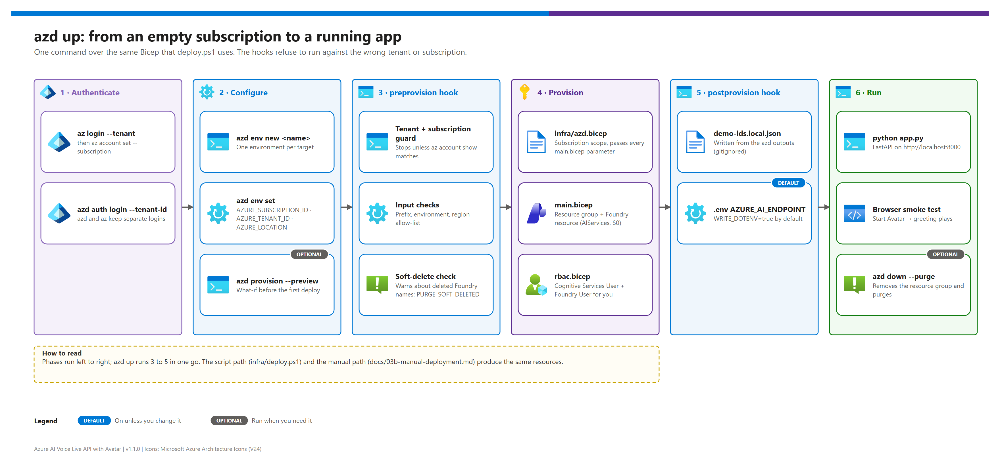

[README](../README.md) › [docs index](./00-reproduce-this-demo.md) › 03 Deployment

# 03 — Deployment

<p>
&nbsp;
&nbsp;
&nbsp;
&nbsp;
&nbsp;

</p>

    

The canonical, phased deployment reference. It opens with tenant-explicit sign-in and the one-command **`azd up`** fast path, then covers the script path over the same Bicep, app install, the cloud smoke test, the opt-in hybrid fallback and production hardening. Every phase ends with a validation gate — don't start the next phase until it passes. Prefer clicking through the portal? Use [03b — Manual deployment](./03b-manual-deployment.md); first time end to end? Use [00 — Reproduce this demo](./00-reproduce-this-demo.md).

## At a glance

| | Phase | Required? | Time (first run, indicative) |
|---|---|---|---|
|  | **0** Authenticate to the right tenant | Always | 2 min |
|  | **Fast path** `azd up` *or* **1** script path | Always (pick one) | 5–10 min |
|  | **2** Install and configure the app | Always | 5–10 min |
|  | **3** Run and validate the cloud path | Always | 5 min |
|  | **4** Hybrid fallback | Opt-in | 90–120 min |
|  | **5** Production hardening | Optional | varies |

## Choose a path

| Path | Best for | What it writes for you |
|---|---|---|
|  **Fast path — `azd up`** | One command, tenant-guarded, repeatable environments | `.azure/<env>/.env`, `demo-ids.local.json`, `AZURE_AI_ENDPOINT` in `.env` |
| **Script path — `infra/deploy.ps1`** | Pipelines, or teams that don't use azd | `demo-ids.local.json`; `.env` with `-WriteEnv` |
|  **Manual — portal or az CLI** | Workshops, IaC-restricted subscriptions | Nothing — you fill `.env` by hand ([03b](./03b-manual-deployment.md)) |
| **Recommendation** | **`azd up`** unless policy forbids IaC | |

All three create the same thing: a resource group, a Microsoft Foundry resource (`kind=AIServices`, S0, custom domain, system-assigned identity) and the **Cognitive Services User** + **Foundry User** role assignments for the principals you name.

## Phase 0 — Authenticate to the right tenant

> [!WARNING]
> **Tenant drift is the most common deployment failure.** The Azure CLI and azd keep **separate** logins and both silently keep whatever account signed in last. Sign in to the intended tenant explicitly, set the subscription, and verify — never run a bare `az login` or `azd up`.

```pwsh
$TenantId       = "<tenant-id>"
$SubscriptionId = "<subscription-id>"

az login --tenant $TenantId                # add --use-device-code without a browser
az account set --subscription $SubscriptionId
az account show --query "{tenant:tenantId, subscription:id, user:user.name}" -o table

azd auth login --tenant-id $TenantId       # azd path only
```

**Gate — Phase 0**

- [ ] `az account show` reports the intended tenant **and** subscription.
- [ ] `azd auth login --check-status` reports a signed-in account (azd path).

## Fast path — azd up

[](./assets/azd-deployment-flow.png)

<sub>Editable source: [`assets/azd-deployment-flow.drawio`](./assets/azd-deployment-flow.drawio) — regenerate with `python scripts/export_diagrams.py docs/assets`.</sub>

| Step | | Action | Gate |
|---|---|---|---|
| **1** |  | `azd env new <name>` (2–32 lowercase letters, digits, hyphens) | ☐ `azd env list` shows it as default |
| **2** |  | `azd env set AZURE_TENANT_ID`, `AZURE_SUBSCRIPTION_ID`, `AZURE_LOCATION` (+ any [optional variables](./07-configuration-reference.md#azd-environment-variables)) | ☐ `azd env get-values` shows them |
| **3** |  | Optional what-if: `azd provision` with the what-if flag (see the commands below) | ☐ Only the expected RG, account and role assignments |
| **4** |  | `azd up` (infra-only template, so this provisions) | ☐ Hooks pass; outputs printed |
| **5** |  | Check `.env` (`AZURE_AI_ENDPOINT`) and `demo-ids.local.json` | ☐ Both written by `postprovision` |

<details><summary><b>Show the azd commands</b></summary>

```pwsh
azd env new voice-avatar-dev
azd env set AZURE_TENANT_ID       $TenantId
azd env set AZURE_SUBSCRIPTION_ID $SubscriptionId
azd env set AZURE_LOCATION        eastus2          # Tier 1 — see 02 §1.3
# Optional knobs (defaults shown):
# azd env set WORKLOAD_PREFIX avla
# azd env set DEMO_ENVIRONMENT dev
# azd env set ADDITIONAL_PRINCIPAL_IDS "<object-id>,<object-id>"
# azd env set WRITE_DOTENV false                   # don't touch .env
# azd env set PURGE_SOFT_DELETED true              # purge a soft-deleted account with the same name

azd provision --preview                            # what-if, no changes
azd up                                             # preprovision -> Bicep -> postprovision
azd env get-values                                 # AZURE_AI_ENDPOINT, FOUNDRY_NAME, ...
```

</details>

### What the hooks do

| Hook | Checks / actions | Fails when |
|---|---|---|
|  `preprovision` | Validates `AZURE_ENV_NAME`, `DEMO_ENVIRONMENT`, `WORKLOAD_PREFIX`, `AZURE_LOCATION` (allow-list + Tier-1 note), `AZURE_PRINCIPAL_TYPE`, flags; then compares `az account show` with `AZURE_TENANT_ID` / `AZURE_SUBSCRIPTION_ID`; then looks for soft-deleted Foundry accounts with the same name prefix | Any input is invalid, either ID is missing, the CLI context differs, or a soft-deleted name collides (unless `PURGE_SOFT_DELETED=true`) |
|  `postprovision` | Writes `demo-ids.local.json` from the outputs; writes `AZURE_AI_ENDPOINT` into `.env` (seeded from `.env.example`) unless `WRITE_DOTENV=false` | The `AZURE_AI_ENDPOINT` output is missing |

Both hooks share `infra/hooks/common.ps1` with `infra/deploy.ps1`, so the azd and script paths validate and write identically. `infra/azd.bicep` is subscription-scoped and passes every `main.bicep` parameter through; outputs are listed in [07 § Outputs](./07-configuration-reference.md#outputs).

> [!TIP]
> Tear down with `azd down --purge`: it deletes the resource group and purges the soft-deleted Foundry account so the same name can be reused immediately. Role propagation after `azd up` can take up to 5 minutes — retry the smoke test before debugging RBAC.

**Gate — Fast path**

- [ ] `azd up` finished and printed `Preprovision checks passed` and `Provisioned. Next:`.
- [ ] `.env` contains `AZURE_AI_ENDPOINT=https://<name>.services.ai.azure.com`.
- [ ] Continue at [Phase 2](#phase-2--install-and-configure-the-app).

## Phase 1 — Script path (infra/deploy.ps1)

Use this instead of azd when you want the same Bicep from a script or pipeline.

```
infra/
├── azd.bicep               # azd entry point (subscription scope) → main.bicep
├── azd.parameters.json     # azd ${VAR=default} substitutions
├── hooks/                  # preprovision.ps1, postprovision.ps1, common.ps1 (shared with deploy.ps1)
├── main.bicep              # subscription-scope entry point
├── main.parameters.json    # template — copy to main.parameters.local.json (gitignored) and edit
├── modules/
│   ├── foundry.bicep       # Microsoft.CognitiveServices/accounts (kind=AIServices)
│   └── rbac.bicep          # Cognitive Services User + Foundry User assignments
└── deploy.ps1              # wrapper around az deployment sub create
```

```pwsh
Copy-Item infra\main.parameters.json infra\main.parameters.local.json
notepad infra\main.parameters.local.json   # location, environment, workloadPrefix, appPrincipalObjectIds

pwsh .\infra\deploy.ps1 -TenantId $TenantId -SubscriptionId $SubscriptionId `
    -ParametersFile .\infra\main.parameters.local.json -WhatIf
pwsh .\infra\deploy.ps1 -TenantId $TenantId -SubscriptionId $SubscriptionId `
    -ParametersFile .\infra\main.parameters.local.json -WriteEnv -Verify
```

> [!IMPORTANT]
> Since v1.1.0, `deploy.ps1` requires `-TenantId` and `-SubscriptionId` (unless `-SkipLogin` in CI), stops when `az account show` doesn't match, and passes `--subscription` explicitly. It always writes `demo-ids.local.json`; `-WriteEnv` also writes `.env`.

| Parameter | Default | Purpose |
|---|---|---|
| `location` | `eastus2` | Region — restricted to regions with Voice Live ([02 §1.3](./02-prerequisites.md#13-regional-availability-matrix)) |
| `environment` | `dev` | `dev` / `test` / `prod`, baked into names and tags |
| `workloadPrefix` | `avla` | 3–8 character prefix used in default names |
| `resourceGroupNameOverride` | `""` | Override `rg-<prefix>-<env>-<region>` |
| `foundryNameOverride` | `""` | Override `aif-<prefix>-<env>-<region>-<unique>` (globally unique) |
| `foundrySku` | `S0` | Only S0 is supported |
| `appPrincipalObjectIds` | `[]` | Object IDs that get Cognitive Services User + Foundry User |
| `appPrincipalType` | `User` | `User`, `ServicePrincipal` or `Group` (one type per deployment) |
| `tags` | see template | Applied to every resource |

| Output | Where to use it |
|---|---|
| `azureAiEndpoint` | → `AZURE_AI_ENDPOINT` in `.env` (`*.services.ai.azure.com`) |
| `cognitiveServicesEndpoint` | → `SPEECH_BILLING` for the Speech containers (Phase 4) |
| `foundryName` / `resourceGroupName` | `az cognitiveservices account keys list` for the container key |
| `foundryPrincipalId` | Grant **Foundry User** on a model's resource for BYOM cross-resource |
| `roleAssignmentsCreated` | Count of principals that received the runtime roles |

Idempotency: role assignments use deterministic `guid()` names and the Foundry account is matched by name, so re-runs update tags/identity rather than re-creating.

<details><summary><b>CI/CD sketch (not shipped)</b></summary>

```yaml
# .github/workflows/deploy-azure.yml — use workload identity federation, no stored secret
- uses: azure/login@v2
  with:
    client-id: ${{ vars.AZURE_CLIENT_ID }}
    tenant-id: ${{ vars.AZURE_TENANT_ID }}
    subscription-id: ${{ vars.AZURE_SUBSCRIPTION_ID }}
- run: |
    pwsh ./infra/deploy.ps1 -SkipLogin -SubscriptionId ${{ vars.AZURE_SUBSCRIPTION_ID }} \
      -TenantId ${{ vars.AZURE_TENANT_ID }} -ParametersFile ./infra/main.parameters.json
```

</details>

**Gate — Phase 1**

- [ ] `az role assignment list --scope <foundry-id> --query "[].roleDefinitionName" -o tsv` lists Cognitive Services User and Foundry User (or Azure AI User while the rename rolls out).
- [ ] `curl.exe -sS -I https://<name>.services.ai.azure.com` returns any HTTP status (proves DNS + TLS).

## Phase 2 — Install and configure the app

```pwsh
git clone <your-repo-url> ai-voice-live-avatar
cd ai-voice-live-avatar
python -m venv .venv
. .\.venv\Scripts\Activate.ps1          # macOS/Linux: . ./.venv/bin/activate
python -m pip install --upgrade pip
pip install -r requirements.txt

Copy-Item .env.example .env              # skip if azd/deploy.ps1 already created .env
notepad .env                             # AZURE_AI_ENDPOINT, optionally VOICE_LIVE_MODEL
```

| Setting | Value |
|---|---|
| `AZURE_AI_ENDPOINT` | `https://<name>.services.ai.azure.com` (written for you on the azd path) |
| `VOICE_LIVE_MODEL` | `gpt-realtime-2.1` (default) — or another model the region offers ([`hybrid/model-selection.md`](./hybrid/model-selection.md)) |
| Everything else | Defaults; see [07 — Configuration reference](./07-configuration-reference.md) |

**Gate — Phase 2**

```pwsh
python -c "from config import settings; print('Missing:', settings.validate(), 'Model:', settings.VOICE_LIVE_MODEL)"
# Expect: Missing: []  Model: gpt-realtime-2.1
```

## Phase 3 — Run and validate the cloud path

```pwsh
az account show -o table                 # token still for the right tenant?
python app.py                            # Uvicorn running on http://0.0.0.0:8000
curl.exe -sS http://localhost:8000/api/health   # {"status":"ok","missing_keys":[]}
```

| Step | | Browser action | Expected |
|---|---|---|---|
| **1** |  | Open <http://localhost:8000> | Sidebar + empty avatar pane |
| **2** |  | Character `Lisa`, style `casual-sitting`, voice `Ava HD (US, F)`, **Enable Avatar** on → **Start Avatar** | Avatar appears and greets you in 5–10 s |
| **3** |  | Click the mic, ask "What can you do?" | Transcript, then text + audio reply |

**Gate — Phase 3**

- [ ] Status dot green ("Connected"), avatar video and greeting audio play.
- [ ] The mic transcribes your speech; the assistant replies with text + audio.

If anything fails, use [05 — Troubleshooting](./05-troubleshooting.md). **The cloud demo is complete here**; Phases 4–5 are optional.

## Phase 4 — (Optional) Enable the on-prem hybrid fallback

Background and the full design: [06 — Hybrid local fallback](./06-hybrid-local-fallback.md). What stays in Azure vs. moves on-prem: [`hybrid/azure-vs-onprem-responsibility.md`](./hybrid/azure-vs-onprem-responsibility.md).

### 4.1 Use a branch that contains the hybrid code

The hybrid handlers ship on `feature/hybrid-local-fallback` (and branches derived from it) until merged to `main`. `pip install -r requirements.txt` adds the `openai` client used for Foundry Local.

### 4.2 Prepare the edge host

Size it from [02 §2.1](./02-prerequisites.md#21-edge-host-hardware-per-site). For a dev box everything can run on one machine; in production keep the app, the containers and Foundry Local on the same edge host so every hop is loopback.

### 4.3 Start the Speech containers

```pwsh
$env:SPEECH_BILLING = "https://<foundry-name>.cognitiveservices.azure.com/"
$env:SPEECH_API_KEY = az cognitiveservices account keys list `
    --name <foundry-name> --resource-group <resource-group> --subscription $SubscriptionId --query key1 -o tsv

docker compose -f docker-compose.local.yml pull          # about 6 GB the first time
docker compose -f docker-compose.local.yml up -d
docker compose -f docker-compose.local.yml ps            # both services Up
```

### 4.4 Install Foundry Local and download a model

```pwsh
winget install Microsoft.FoundryLocal                    # macOS: brew install foundrylocal; Linux: see Foundry Local docs
foundry model download qwen2.5-7b-instruct               # about 5 GB; or phi-4
foundry service start
foundry service status                                   # prints the port, usually http://localhost:5273
```

> [!NOTE]
> Foundry Local now supports **Windows, macOS (Apple silicon) and Linux** ([What is Foundry Local](https://learn.microsoft.com/azure/foundry-local/what-is-foundry-local)). vLLM (`vllm serve Qwen/Qwen2.5-7B-Instruct --port 5273 --served-model-name qwen2.5-7b-instruct`) still works when you prefer it — the app only needs an OpenAI-compatible `/v1/chat/completions`.

### 4.5 Wire the app to the local stack

```env
ENABLE_LOCAL_FALLBACK=true
LOCAL_STT_ENDPOINT=http://localhost:5001
LOCAL_TTS_ENDPOINT=http://localhost:5002
LOCAL_TTS_VOICE=en-US-JennyNeural        # must match the NTTS container tag
LOCAL_LLM_ENDPOINT=http://localhost:5273/v1
LOCAL_LLM_MODEL=qwen2.5-7b-instruct      # must match the Foundry Local alias
```

Restart `python app.py`.

**Gate — Phase 4**

<details><summary><b>Show the container and app checks</b></summary>

```bash
# STT — an empty POST proves routing (returns an error envelope)
curl -sS -X POST "http://localhost:5001/speech/recognition/conversation/cognitiveservices/v1?language=en-US" \
  -H "Content-Type: audio/wav; codecs=audio/pcm; samplerate=16000" --data-binary "@/dev/null" | head -c 200; echo

# NTTS — synthesize "Hello" to a WAV
curl -sS -X POST "http://localhost:5002/cognitiveservices/v1" \
  -H "Content-Type: application/ssml+xml" -H "X-Microsoft-OutputFormat: riff-24khz-16bit-mono-pcm" \
  -H "User-Agent: setup-test" -o hello.wav \
  --data '<speak version="1.0" xml:lang="en-US"><voice name="en-US-JennyNeural">Hello.</voice></speak>'

# Foundry Local
curl -sS http://localhost:5273/v1/models | head -c 200; echo

# App: enableLocalFallback true, supervisor.reachable true, localStack populated, missingLocalConfig []
curl -sS http://localhost:8000/api/hybrid/status
```

</details>

- [ ] All four checks above pass.
- [ ] The hybrid matrix in [04 §3](./04-testing.md#3-hybrid-test-matrix-phase-4-only) passes for cloud, forced-local and simulated-outage modes.

## Phase 5 — (Optional) Production hardening

Each item is independent; adopt what fits your operating model.

### 5.1 Run the app as a service

| OS | How |
|---|---|
| Linux (systemd) | Unit pointing at `python app.py` in the venv, `User=` a service account, `Restart=always`; `systemctl enable --now voice-live-avatar` |
| Windows | Wrap `python app.py` as a service with [NSSM](https://nssm.cc/) |

### 5.2 Pin container tags

Already pinned in `docker-compose.local.yml` — never switch to `:latest` in production; trial tag bumps on a lab site first.

### 5.3 Route logs to your SIEM

The STT container logs recognized text by default. Either keep logs on the host (`/var/log/<service>`) or ship them through a redacting log shipper.

### 5.4 Switch container metering to disconnected (offline-tolerant sites)

Needs Microsoft approval and a commitment-tier purchase.

```bash
mkdir -p ./speech-licenses/stt ./speech-licenses/tts
docker run --rm -v $(pwd)/speech-licenses/stt:/license \
  mcr.microsoft.com/azure-cognitive-services/speechservices/speech-to-text:5.1.0-amd64-en-us \
  Eula=accept Billing="$SPEECH_BILLING" ApiKey="$SPEECH_API_KEY" DownloadLicense=True Mounts:License=/license
# repeat for the NTTS image, then mount the license dir read-only in docker-compose.local.yml
# and drop ApiKey/Billing at runtime; refresh the license about every 30 days
```

Reference: [Use containers in disconnected environments](https://learn.microsoft.com/azure/ai-services/containers/disconnected-containers).

### 5.5 Tune VAD for the site's acoustic environment

| Variable | Default | Tune when |
|---|---|---|
| `LOCAL_VAD_RMS_THRESHOLD` | `350` | Noisy room → 500–800; quiet room → 200–250 |
| `LOCAL_VAD_SILENCE_MS` | `700` | Snappier turns → lower; slow speakers → 1000–1200 |
| `LOCAL_VAD_MIN_SPEECH_MS` | `250` | Filters mic clicks; rarely changed |
| `LOCAL_VAD_MAX_UTTERANCE_MS` | `20000` | Raise if users talk longer than 20 s |

Calibration procedure: [04 §5](./04-testing.md#5-vad-tuning-and-acoustic-validation).

### 5.6 Identity

| Use case | What to use |
|---|---|
| Dev box | `az login --tenant <id>` (the app's `DefaultAzureCredential` picks it up) |
| Linux VM | Managed identity on the VM |
| Container / Kubernetes | Workload identity |
| CI/CD smoke deploys | Service principal with federated credentials (no stored secret) |

### 5.7 Observability

- `/api/health` — liveness + config sanity (load balancer probe).
- `/api/hybrid/status` — supervisor state + local-stack config; alert on `reachable: false` for longer than your runbook allows.

## Reference

| Doc | Purpose |
|---|---|
| [00 — Reproduce this demo](./00-reproduce-this-demo.md) | One continuous walkthrough |
| [03b — Manual deployment](./03b-manual-deployment.md) | Portal / az CLI path |
| [04 — Testing](./04-testing.md) · [05 — Troubleshooting](./05-troubleshooting.md) | Validation and fixes, including the azd triage section |
| [07 — Configuration reference](./07-configuration-reference.md) | Every azd variable, output and runtime setting |

---

Next: [03b — Manual deployment](./03b-manual-deployment.md) →

*Last updated: 2026-10-07*
