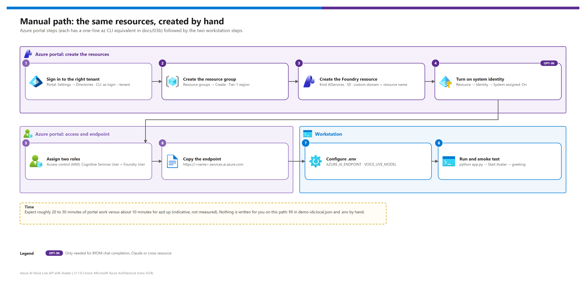

[README](../README.md) › [docs index](./00-reproduce-this-demo.md) › 03b Manual deployment

# 03b — Manual deployment (portal or az CLI)

<p>
&nbsp;
&nbsp;
&nbsp;
&nbsp;
&nbsp;

</p>

   

The no-IaC path: create the **same** resource group, Microsoft Foundry resource and role assignments that `azd up` and `infra/deploy.ps1` create, by hand in the Azure portal — with a one-line az CLI equivalent for every step. Use it in workshops where each resource should be created visibly, or in subscriptions where IaC tooling isn't allowed. Only the provisioning phase differs; app install, the smoke test and the hybrid path are shared with [03 — Deployment](./03-deployment.md).

## At a glance

| | Topic | One-line answer |
|---|---|---|
|  | **Creates** | Resource group + Foundry resource (`AIServices`, S0, custom domain, system identity) + 2 role assignments |
|  | **Roles** | **Cognitive Services User** + **Foundry User** (shown as *Azure AI User* in some places during the rename) |
|  | **Written for you** | Nothing — fill `.env` and (optionally) `demo-ids.local.json` by hand |
|  | **Time** | About 20–30 min of portal work vs. about 10 min for `azd up` (indicative, not measured) |

## The steps

[](./assets/manual-deployment-steps.png)

<sub>Editable source: [`assets/manual-deployment-steps.drawio`](./assets/manual-deployment-steps.drawio) — regenerate with `python scripts/export_diagrams.py docs/assets`.</sub>

| Step | | Portal | az CLI equivalent | Gate |
|---|---|---|---|---|
| **1** |  | **Settings → Directories + subscriptions**: switch to the intended tenant; pick the subscription | `az login --tenant <tenant-id>` · `az account set --subscription <subscription-id>` | ☐ Correct tenant + subscription |
| **2** |  | **Resource groups → Create**: name `rg-avla-dev-eastus2`, region from Tier 1 | `az group create -n $RgName -l $Region` | ☐ RG exists |
| **3** |  | **Microsoft Foundry → Create a resource**: kind *AI Services*, pricing tier S0, same region; set the custom domain to the resource name | `az cognitiveservices account create --kind AIServices --sku S0 --custom-domain …` | ☐ Endpoint `https://<name>.services.ai.azure.com` |
| **4** |  | **Resource → Identity → System assigned: On** (needed for BYOM)  | `--assign-identity` on step 3, or `az cognitiveservices account identity assign` | ☐ Object ID shown |
| **5** |  | **Resource → Access control (IAM) → Add role assignment**: *Cognitive Services User*, then *Foundry User*, to yourself (or the app identity) | `az role assignment create --role … --scope …` (×2) | ☐ Both roles listed |
| **6** |  | **Resource → Overview / Keys and Endpoint**: copy the `services.ai.azure.com` endpoint | `az cognitiveservices account show --query properties.endpoint` | ☐ Endpoint copied |
| **7** |  | Copy `.env.example` to `.env`; set `AZURE_AI_ENDPOINT` (and `VOICE_LIVE_MODEL` if not the default) | — | ☐ `settings.validate()` returns `[]` |
| **8** |  | `python app.py` → <http://localhost:8000> → **Start Avatar** | — | ☐ Avatar greets you |

> [!WARNING]
> Step 1 matters even in the portal: the portal remembers the last directory you used. Check the tenant name in the top-right account menu before creating anything, and keep the CLI on the same tenant (`az account show`).

## Az CLI walkthrough

The same eight steps as a script you can paste into `pwsh` (from [the original manual section of 03](./03-deployment.md#choose-a-path), moved here in v1.1.0).

```pwsh
# 1. Tenant-explicit sign-in
$TenantId       = "<tenant-id>"
$SubscriptionId = "<subscription-id>"
az login --tenant $TenantId
az account set --subscription $SubscriptionId
az account show -o table

# Variables (customize)
$Region      = "eastus2"                                   # Tier 1 — docs/02-prerequisites.md §1.3
$RgName      = "rg-avla-dev-$Region"
$FoundryName = "aif-avla-dev-$Region-$(Get-Random -Maximum 999)"   # globally unique

# 2. Resource group
az group create --name $RgName --location $Region --subscription $SubscriptionId -o table

# 3 + 4. Foundry resource with a custom domain and a system-assigned identity
az cognitiveservices account create `
    --name $FoundryName --resource-group $RgName --location $Region `
    --kind AIServices --sku S0 --custom-domain $FoundryName `
    --assign-identity --subscription $SubscriptionId --yes -o table
```

No model deployment is needed for the built-in `gpt-realtime-2.1` — Voice Live serves it directly. Deploy a model only for BYOM ([`hybrid/model-selection.md`](./hybrid/model-selection.md)).

```pwsh
# 5. Runtime roles for yourself (use role IDs: the Foundry role names were renamed recently)
$Me    = az ad signed-in-user show --query id -o tsv
$Scope = az cognitiveservices account show --name $FoundryName --resource-group $RgName `
            --subscription $SubscriptionId --query id -o tsv
az role assignment create --assignee-object-id $Me --assignee-principal-type User `
    --role "a97b65f3-24c7-4388-baec-2e87135dc908" --scope $Scope -o table   # Cognitive Services User
az role assignment create --assignee-object-id $Me --assignee-principal-type User `
    --role "53ca6127-db72-4b80-b1b0-d745d6d5456d" --scope $Scope -o table   # Foundry User

# 6. Endpoint for .env
"AZURE_AI_ENDPOINT=https://$FoundryName.services.ai.azure.com"
```

<details><summary><b>Optional: BYOM chat completion / Claude / cross-resource — grant the resource identity Foundry User</b></summary>

```pwsh
$Mi = az cognitiveservices account show --name $FoundryName --resource-group $RgName `
        --subscription $SubscriptionId --query identity.principalId -o tsv
# Same resource (BYOM chat completion or Claude with Entra auth):
az role assignment create --assignee-object-id $Mi --assignee-principal-type ServicePrincipal `
    --role "53ca6127-db72-4b80-b1b0-d745d6d5456d" --scope $Scope
# Cross-resource override: use the MODEL resource's ID as --scope instead.
```

</details>

**Gate — manual provisioning**

```pwsh
az role assignment list --assignee $Me --scope $Scope --query "[].roleDefinitionName" -o tsv
# Expect: Cognitive Services User and Foundry User (or Azure AI User during the rename)
curl.exe -sS -I "https://$FoundryName.services.ai.azure.com" | Select-Object -First 1
# Any HTTP status (200/401/404) proves DNS + TLS
```

> [!NOTE]
> Role propagation can take up to 5 minutes. If the first session fails with `403` / `AuthorizationFailed`, wait and retry before changing anything.

## Manual vs. automated paths

| | Manual (this doc) | `azd up` | `infra/deploy.ps1` |
|---|---|---|---|
| **Time (indicative)** | 20–30 min | ~10 min | ~10 min |
| **Tenant guard** | You check it | `preprovision` hook enforces it | `-TenantId` / `-SubscriptionId` enforced |
| **Soft-delete collision check** | You check `az cognitiveservices account list-deleted` | Hook checks (and purges on request) | — |
| **Writes `.env`** | ❌ by hand | ✅ (`WRITE_DOTENV=true`) | ✅ with `-WriteEnv` |
| **Writes `demo-ids.local.json`** | ❌ by hand (shape: `demo-ids.template.json`) | ✅ | ✅ |
| **Recommendation** | Workshops / IaC-restricted | **Default** | Pipelines |

## Continue

| Next phase | Where |
|---|---|
| Install the app, configure `.env`, smoke test | [03 — Phase 2](./03-deployment.md#phase-2--install-and-configure-the-app) and [Phase 3](./03-deployment.md#phase-3--run-and-validate-the-cloud-path) |
| Hybrid fallback (unchanged by the provisioning path) | [03 — Phase 4](./03-deployment.md#phase-4--optional-enable-the-on-prem-hybrid-fallback) |
| Clean up | `az group delete --name $RgName --yes --no-wait`, then `az cognitiveservices account purge --location $Region --resource-group $RgName --name $FoundryName` to free the name |

---

Next: [04 — Testing](./04-testing.md) →

*Last updated: 2026-10-07*
