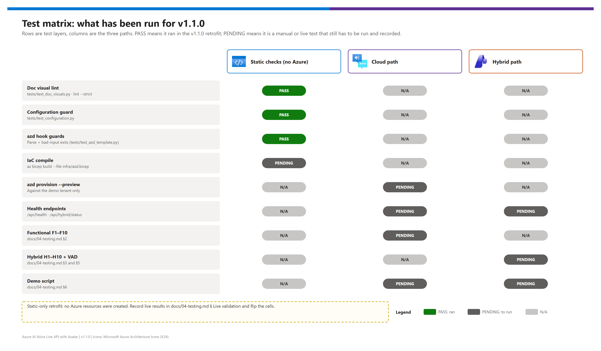

[README](../README.md) › [docs index](./00-reproduce-this-demo.md) › 04 Testing

# 04 — Testing

<p>
&nbsp;
&nbsp;
&nbsp;
&nbsp;
&nbsp;

</p>

  

The test plan for the pattern: static checks that run anywhere (docs, configuration, azd hooks, diagrams), the cloud functional tests (F1–F10), the hybrid matrix (H1–H10), VAD calibration, a 5-minute demo script and indicative performance numbers. Each layer says whether it has been run for the current version, so a presenter knows what is proven and what still needs a live run.

## At a glance

| | Layer | Status for v1.1.0 |
|---|---|---|
|  | Static checks: doc lint, configuration guard, azd hook guards |  run in the retrofit |
|  | IaC compile (`az bicep build`) | To run where the Bicep CLI is installed |
|  | Cloud F1–F10 and demo script | To run on Azure (no recorded results yet) |
|  | Hybrid H1–H10 + VAD | To re-run on an edge host  |

## Test layers

[](./assets/testing-matrix.png)

<sub>Editable source: [`assets/testing-matrix.drawio`](./assets/testing-matrix.drawio) — regenerate with `python scripts/export_diagrams.py docs/assets`.</sub>

| Layer | What it proves | How | Status |
|---|---|---|---|
| Doc visual lint | Every doc meets the visual standard; links and anchors resolve | `python scripts/lint_doc_visuals.py --strict` (also `tests/test_doc_visuals.py`) |  |
| Configuration guard | Every azd variable, Bicep output, hook variable and app env var is documented in [07](./07-configuration-reference.md); `azd.bicep` passes every `main.bicep` parameter | `tests/test_configuration.py` |  |
| azd template guards | `azure.yaml` wiring, quoted substitutions, allow-list parity, hooks fail cleanly on bad input before any az call | `tests/test_azd_template.py` |  |
| Diagrams | `.drawio` sources have exported PNGs that are present and fresh | `python scripts/export_diagrams.py docs/assets --check` |  |
| IaC compile | `azd.bicep` → `main.bicep` → modules compile | `az bicep build --file infra/azd.bicep` | to run |
| Cloud functional | F1–F10 below | Manual in the browser | to run — no recorded results |
| Hybrid | H1–H10 + VAD below | Manual on an edge host | to run — §7 latencies were measured on v1.0, pass/fail was not recorded |

## Automated checks

```pwsh
pip install pytest                                       # dev only
python -m pytest tests -q                                # doc visuals + configuration + azd guards
python scripts/lint_doc_visuals.py --strict              # same lint, with the full report
python scripts/export_diagrams.py docs/assets --check    # fails on a missing or stale PNG (needs no draw.io)
python scripts/export_diagrams.py docs/assets            # re-export after editing a .drawio (needs draw.io desktop)
az bicep build --file infra/azd.bicep --stdout > $null   # compile check
```

> [!NOTE]
> The tests are static: they never call Azure and never sign in. `.github/workflows/validate.yml` runs them, the strict lint and an `az bicep build` on every pull request. The azd hook test runs `infra/hooks/preprovision.ps1` with deliberately bad inputs (for example `AZURE_ENV_NAME=Bad-Name`) and expects a clean, non-zero exit **before** the Azure CLI is touched.

## 1. Pre-flight (always)

```pwsh
python app.py
curl.exe -sS http://localhost:8000/api/health
curl.exe -sS http://localhost:8000/api/hybrid/status
```

| Check | Expected |
|---|---|
| `/api/health` | `{"status":"ok","missing_keys":[]}` |
| `/api/hybrid/status` (cloud-only) | `enableLocalFallback: false`, `supervisor: null` |
| `/api/hybrid/status` (hybrid on) | `supervisor.reachable: true`, `missingLocalConfig: []` |

## 2. Functional tests — cloud path (Phase 3)

| # | Pre-conditions | Action | Expected result |
|---|---|---|---|
| F1 | Default `.env`, **Enable Avatar** on | **Start Avatar** | Avatar within ~10 s; greeting plays; status `Connected` |
| F2 | F1 | Mic: "What can you do?" | `Listening…`, your transcript, streamed assistant text, audio |
| F3 | F2 | Type "Tell me a joke", Enter | Text + audio reply without the mic |
| F4 | F1 | Talk while the assistant speaks | Playback stops within ~100 ms (barge-in); new utterance transcribed |
| F5 | **Enable Avatar** off | Start | No video pane; voice + text work |
| F6 | Voice `Ada HD (UK, F)`, restart session | Speak / type | Reply uses the new HD voice |
| F7 | Voice `Jenny (US, F)` (standard), restart | Speak / type | Works — the same voice the local mode uses by default |
| F8 | `ENABLE_WEATHER_TOOL=true`, restart app | "What's the weather in Seattle?" | Tool called; log shows `Function call: get_weather(...)` |
| F9 | F8 + browser geolocation allowed | "What's the weather near me?" | Uses the browser's coordinates |
| F10 | `VOICE_LIVE_MODEL=gpt-realtime-mini` (or `gpt-realtime-1.5`), restart | Repeat F1 | Log shows `Connecting — endpoint=..., model=gpt-realtime-mini`; session works |

<details><summary><b>Expected browser event sequence — cloud turn (F2)</b></summary>

```
→ start_session
← session_started { mode: "cloud", avatarEnabled: true }
← ice_servers
← avatar_sdp_answer

→ audio_chunk * N
← speech_started
← speech_stopped
← transcript_delta / transcript_done (role=user)
← response_created
← transcript_delta / transcript_done (role=assistant)
← (avatar audio + video play via WebRTC)
← response_done
```

</details>

## 3. Hybrid test matrix (Phase 4 only)

| # | Pre-conditions | Action | Expected result |
|---|---|---|---|
| H1 | `ENABLE_LOCAL_FALLBACK=false` (default) | Start a session | Same as F1; badge hidden; log `Session ... → cloud` |
| H2 | Fallback on, cloud reachable, local stack down | Start | **Cloud** mode, blue `CLOUD` badge, no banner |
| H3 | Fallback on, `FORCE_LOCAL_MODE=true`, local stack up | Start | Orange `LOCAL` badge; banner `(force-local-env)`; greeting via NTTS |
| H4 | Fallback on, bogus `AZURE_AI_ENDPOINT`, restart | Wait > `FAILOVER_FAILURE_THRESHOLD × FAILOVER_PROBE_INTERVAL_S`, start | `LOCAL`; banner `(cloud-unreachable: ...)`; `/api/hybrid/status` `reachable: false` |
| H5 | H4, restore the endpoint, restart | Wait one probe interval, start | **Cloud** again; `reachable: true` |
| H6 | H3 running | Mic: "What is two plus two?" | Transcript, reply text, audio; one request each in STT / LLM / TTS logs |
| H7 | H3 running | Type a message | Reply text + audio; STT untouched |
| H8 | H3 running | Talk over the assistant | Playback stops within ~100 ms |
| H9 | Fallback on, wrong `LOCAL_TTS_VOICE` | Force local, start | Greeting fails; `local-tts failed: ... 404 / 400`; cloud unaffected |
| H10 | Fallback on, empty `LOCAL_LLM_MODEL` | Force local, start | `session_error`: `local-fallback misconfigured: missing LOCAL_LLM_MODEL` |

<details><summary><b>Expected browser event sequence — local turn (H6)</b></summary>

```
→ start_session
← session_started { mode: "local", avatarEnabled: false }
← mode_notice { mode: "local", reason: "..." }
← response_created   (greeting)
← transcript_delta / transcript_done (role=assistant)
← audio_data * N
← audio_done / response_done

→ audio_chunk * N      (user speaking)
← speech_started
... silence ...
← speech_stopped
← transcript_done (role=user, transcript="...")
← response_created
← transcript_delta / transcript_done (role=assistant)
← audio_data * N
← audio_done / response_done
```

</details>

## 4. Regression check — cloud parity after hybrid changes

| Changed | Re-run |
|---|---|
| `session_handlers/local.py`, `connectivity.py`, `local_clients/` | H1 (fallback off), then F1 + F2 |
| `config.py` defaults or `.env.example` | `python -m pytest tests -q` (configuration guard), then F1 + F10 |
| `infra/**` or `azure.yaml` | `python -m pytest tests -q`, `az bicep build --file infra/azd.bicep`, then a what-if provision against the demo tenant ([03 § Fast path](./03-deployment.md#fast-path--azd-up)) |
| `docs/**` or a `.drawio` | `python scripts/lint_doc_visuals.py --strict`, `python scripts/export_diagrams.py docs/assets --check` |

## 5. VAD tuning and acoustic validation

Local mode uses energy-based VAD: the defaults suit a quiet office; tune the threshold per site.

| Step | Calibration |
|---|---|
| 1 | Temporarily set `LOCAL_VAD_RMS_THRESHOLD=0` (everything is voiced) |
| 2 | Record 5 s of silence on the deployment mic; note the RMS floor in the `Audio chunk #N` log lines (for example 80–120) |
| 3 | Repeat with normal speech; note the voiced floor (for example 600–1500) |
| 4 | Set `LOCAL_VAD_RMS_THRESHOLD` halfway between the two (typically 350–500) |

| Acceptance test | Expected |
|---|---|
| 3 s of silence | `speech_started` does **not** fire |
| 2 s sentence + 1 s silence | `speech_started` within 100 ms of onset; `speech_stopped` ~700 ms after speech ends |
| ~10 s continuous answer | One utterance, no premature `speech_stopped` |
| Talking over assistant audio | Playback cancelled within ~100 ms; new utterance captured |

## 6. Demo script (for stakeholder showings)

| Minute | Action | What the audience sees |
|---|---|---|
| 0:00 | Open <http://localhost:8000> | Empty avatar pane + sidebar |
| 0:30 | **Start Avatar** | The avatar appears and greets the room |
| 1:00 | Mic: "What can you do?" | Reply; status pill alternates speaking / listening |
| 1:30 | (Weather tool on) "What's the weather in Seattle?" | Short pause while the tool runs, then the forecast |
| 2:00 | Switch to `Ada HD (UK, F)`, reconnect | Same UI, different HD voice |
| 2:30 | Untick **Enable Avatar**, reconnect | Voice-only — same chat, no video |
| 3:00 | (Hybrid) `FORCE_LOCAL_MODE=true`, restart, reconnect | Orange **LOCAL** badge + banner; greeting from the edge host |
| 3:30 | (Hybrid) Ask a question by mic | `docker compose logs -f` shows STT / LLM / TTS working locally |
| 4:30 | Stop; walk through the comparison in [01](./01-architecture.md#cloud-mode-vs-local-fallback-mode) and [`hybrid/azure-vs-onprem-responsibility.md`](./hybrid/azure-vs-onprem-responsibility.md) | What stays in Azure vs. runs on-prem |

> [!CAUTION]
> Don't demo the Jeff avatar (retiring December 2026) or suggest an on-prem avatar is available — none exists. Rehearse in the target region the day before: avatar capacity is limited in some regions.

## 7. Performance baselines (informational)

Recorded on one dev box (24 vCPU / 64 GB RAM / NVIDIA L4 16 GB, Foundry Local with `qwen2.5-7b-instruct`) on v1.0:

| Step (local mode) | Latency |
|---|---|
| STT (3 s utterance, REST) | ~0.4 s |
| LLM first token (256-token cap) | ~0.6 s |
| LLM full response | ~1.5 s |
| TTS first audio chunk | ~0.3 s |
| End of utterance → first audio out | **~2.5 s** |
| Cloud mode (`gpt-realtime`, v1.0): end of utterance → first audio out | **~0.5–1.0 s** |

Numbers are indicative: hardware (especially the GPU) and link latency dominate. Re-measure with `gpt-realtime-2.1`.

## Live validation

> [!IMPORTANT]
> v1.1.0 is a documentation, azd and configuration retrofit validated **statically**; no Azure resources were created. Before the next live demo, run Phase 0 → Fast path → F1–F10 (and H1–H10 if you'll show the hybrid path) and record the results here, with secrets redacted, under `docs/assets/evidence/`.

| Run | Date | Region / model | F1–F10 | H1–H10 | Notes |
|---|---|---|---|---|---|
| v1.0 build (pre-retrofit) | 2026-06 | dev box / `gpt-realtime` | — | — | Only the §7 latencies were recorded |
| v1.1.0 | — | `eastus2` / `gpt-realtime-2.1` | ⏳ | ⏳ | Pending a live run |

## 8. Out of scope for this iteration

| Item | Status |
|---|---|
| Automated unit tests for the handlers and local clients | Pending — see [`hybrid/implementation-plan.md`](./hybrid/implementation-plan.md) |
| Load testing | Cloud scales with Voice Live quota; local with edge-host GPU capacity (typically 1–3 sessions per host) |
| Mid-session failover; function calling on the local path | Deferred to v2 |

---

Next: [05 — Troubleshooting](./05-troubleshooting.md) →

*Last updated: 2026-10-07*
