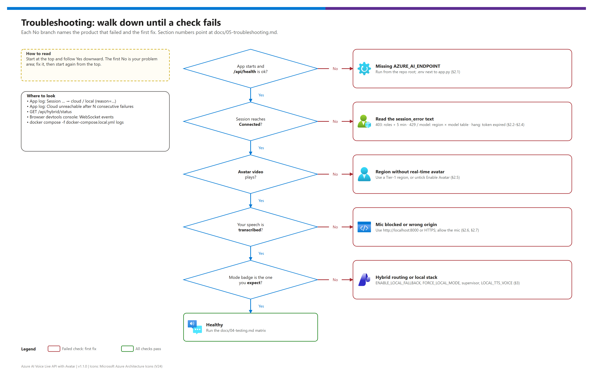

[README](../README.md) › [docs index](./00-reproduce-this-demo.md) › 05 Troubleshooting

# 05 — Troubleshooting

<p>
&nbsp;
&nbsp;
&nbsp;
&nbsp;
&nbsp;

</p>

   

How to diagnose the pattern quickly: a quick-triage table, a decision tree, then one section per symptom with the concrete fix — cloud path (§2), hybrid path (§3), azd and deployment (§4) — followed by operational one-liners and escalation paths. Forward a single section to whoever is stuck; each one stands alone.

## At a glance

| | Where it breaks | First thing to check |
|---|---|---|
|  | App start | `.env` is in the repo root and has `AZURE_AI_ENDPOINT` |
|  | Session connect | Both runtime roles, the right tenant, 5 minutes of propagation |
|  | Model / region | The region offers `VOICE_LIVE_MODEL` ([02 §1.3](./02-prerequisites.md#13-regional-availability-matrix)) |
|  | Avatar | The region offers the real-time avatar |
|  | Hybrid | `/api/hybrid/status` |
|  | azd | The `preprovision` message names the fix |

## Decision tree

[](./assets/troubleshooting-decision-tree.png)

<sub>Editable source: [`assets/troubleshooting-decision-tree.drawio`](./assets/troubleshooting-decision-tree.drawio) — regenerate with `python scripts/export_diagrams.py docs/assets`.</sub>

## 1. Quick triage

| Symptom | Where | Likely cause | Fix |
|---|---|---|---|
| `Missing env vars: AZURE_AI_ENDPOINT` at start |  | `.env` missing or not in the working directory | [§2.1](#21-missing-env-vars-azure_ai_endpoint-on-app-start) |
| `Session error: 403 / AuthorizationFailed` |  | Roles missing, wrong tenant, or propagation | [§2.2](#22-session-error-403--authorizationfailed) |
| `Session error` mentions quota, `429` or the model |  | Model not offered in the region, or rate limited | [§2.3](#23-session-error-mentions-quota-429-or-the-model) |
| Browser hangs at "Connecting…" |  | Region / model mismatch or expired token | [§2.4](#24-browser-hangs-at-connecting) |
| Avatar fails, voice works |  | Region without the real-time avatar | [§2.5](#25-avatar-fails-but-voice-works) |
| No mic permission popup |  | Mic blocked on non-localhost HTTP | [§2.6](#26-no-mic-permission-popup) |
| Audio plays once, then stops |  | Barge-in triggered by noise | [§2.7](#27-audio-plays-once-then-stops) |
| BYOM connect fails or `401/403` with BYOM |  | Wrong deployment name / profile, or the resource identity lacks Foundry User | [§2.8](#28-byom-session-fails) |
| Badge says CLOUD, you wanted LOCAL |  | Fallback disabled or the cloud is still reachable | [§3.1](#31-status-badge-says-cloud-but-you-wanted-local) |
| Banner `(force-local-env)` unexpectedly |  | `FORCE_LOCAL_MODE=true` | [§3.2](#32-banner-says-force-local-env-and-you-didnt-want-it) |
| Local NTTS returns 404 / 400 |  | Voice name ≠ container image tag | [§3.3](#33-local-ntts-returns-404-or-400) |
| Foundry Local is slow |  | Running on CPU | [§3.4](#34-foundry-local-responses-are-slow) |
| Local STT returns empty `DisplayText` |  | Locale mismatch | [§3.5](#35-local-stt-returns-empty-displaytext) |
| Supervisor stays `reachable: false` |  | Probe interval not elapsed, or egress blocked | [§3.6](#36-supervisor-stays-reachable-false-after-fixing-the-endpoint) |
| `missingLocalConfig` lists values that look set |  | Whitespace in `.env` | [§3.7](#37-missinglocalconfig-lists-endpoints-that-look-set) |
| Container exits with `Eula must be accepted` |  | Compose-time variables not set | [§3.8](#38-container-fails-to-start-with-eula-must-be-accepted) |
| `docker compose pull` fails |  | Egress to `mcr.microsoft.com` blocked | [§3.9](#39-docker-compose-pull-fails) |
| `preprovision` refuses to continue |  | Wrong tenant / subscription or bad input | [§4.1](#41-preprovision-refuses-to-continue) |
| `azd up` fails on the Foundry account name |  | Soft-deleted account with the same name | [§4.2](#42-soft-deleted-foundry-resource-blocks-re-creation) |
| Deployment rejects the region |  | Region not in the Bicep allow-list | [§4.3](#43-region-rejected) |

## 2. Cloud-path symptoms

### 2.1 `Missing env vars: AZURE_AI_ENDPOINT` on app start

The app loads `.env` with `python-dotenv` from the **current working directory**. Usual causes: you ran `python app.py` from another folder; Windows hid an extension (`.env.txt`); the file sits in `docs/`.

```pwsh
cd <repo-root>
Get-ChildItem .env
Get-Content .env | Select-String AZURE_AI_ENDPOINT
python app.py
```

On the azd path, `postprovision` writes the value for you unless `WRITE_DOTENV=false`.

### 2.2 `Session error: 403 / AuthorizationFailed`

The app identity lacks **Cognitive Services User** and/or **Foundry User** on the Foundry resource, the token comes from the wrong tenant, or the assignment hasn't propagated.

```pwsh
az account show --query "{tenant:tenantId, subscription:id}" -o table   # right tenant?
$Me    = az ad signed-in-user show --query id -o tsv
$Scope = az cognitiveservices account show --name <foundry-name> --resource-group <rg> --query id -o tsv
az role assignment list --assignee $Me --scope $Scope --query "[].roleDefinitionName" -o tsv
```

> [!NOTE]
> Microsoft renamed **Azure AI User** to **Foundry User** (same role ID `53ca6127-db72-4b80-b1b0-d745d6d5456d`); either name may appear while the rename rolls out. Scripts in this repo assign by role ID.

If both roles are listed, wait 5 minutes and retry. Otherwise grant them ([03b step 5](./03b-manual-deployment.md#az-cli-walkthrough)) or re-run `azd up` (it assigns them to `AZURE_PRINCIPAL_ID`).

### 2.3 `Session error` mentions quota, `429` or the model

The model in `VOICE_LIVE_MODEL` isn't offered in the resource's region, or you are rate limited. Check the [Voice Live tab of the regions page](https://learn.microsoft.com/azure/ai-services/speech-service/regions?tabs=voice-live): for example `gpt-realtime` is **not** offered in `eastus` or `westeurope`, while `gpt-realtime-2.1` is offered in `eastus`. Switch the model ([`hybrid/model-selection.md`](./hybrid/model-selection.md)) or move to a Tier-1 region ([02 §1.3](./02-prerequisites.md#13-regional-availability-matrix)). For BYOM deployments, `az cognitiveservices model list --location <region>` shows deployable versions and the portal shows quota.

### 2.4 Browser hangs at "Connecting…"

- **Region / model mismatch** — see §2.3.
- **Expired or wrong-tenant token** — `az login --tenant <tenant-id>`, then refresh the browser.

A hung WebSocket handshake usually logs a TLS or DNS error within about 30 seconds.

### 2.5 Avatar fails but voice works

The region offers Voice Live but not the real-time avatar (for example `canadacentral`, `uksouth`, `australiaeast`). Untick **Enable Avatar** for a voice-only demo, or recreate the Foundry resource in a Tier-1 region: `eastus2`, `westus2`, `swedencentral`, `southeastasia`, `centralindia`, `eastus`. `francecentral` has limited avatar capacity.

### 2.6 No mic permission popup

Browsers grant the mic only on secure origins — `https://`, or `http://localhost`. Use <http://localhost:8000> (not the LAN IP) or put an HTTPS reverse proxy (Caddy, nginx + Let's Encrypt, a dev tunnel) in front for LAN tests.

### 2.7 Audio plays once, then stops

Barge-in fired: the mic picked up something that VAD treated as speech.

| Mode | Fix |
|---|---|
| Any | Mute the mic in the UI while you only listen |
| Local | Raise `LOCAL_VAD_RMS_THRESHOLD` (default `350`) — [04 §5](./04-testing.md#5-vad-tuning-and-acoustic-validation) |
| Cloud | Tune `AzureSemanticVad` (threshold, silence duration) in `session_handlers/cloud.py`; defaults suit most rooms |

### 2.8 BYOM session fails

| Check | Fix |
|---|---|
| `VOICE_BYOM_MODEL` is the **deployment name** from the Foundry portal, not the model ID | Correct the name |
| `VOICE_BYOM_MODE` matches the deployment type (`byom-azure-openai-realtime`, `…-chat-completion`, `byom-foundry-anthropic-messages`) | Correct the profile |
| `401/403` in chat-completion or Claude mode, or with `VOICE_BYOM_FOUNDRY_RESOURCE_OVERRIDE` | Grant the Voice Live resource's system-assigned identity **Foundry User** (`53ca6127-db72-4b80-b1b0-d745d6d5456d`) on the model's resource ([03b](./03b-manual-deployment.md#az-cli-walkthrough)) |

## 3. Hybrid-path symptoms

### 3.1 Status badge says CLOUD but you wanted LOCAL

`ENABLE_LOCAL_FALLBACK=false`; or the supervisor still sees the cloud (probe every 15 s, flips after `FAILOVER_FAILURE_THRESHOLD` failures); or you meant to force local but didn't set `FORCE_LOCAL_MODE=true`.

```pwsh
curl.exe -sS http://localhost:8000/api/hybrid/status   # enableLocalFallback, forceLocalMode, supervisor.reachable
```

### 3.2 Banner says `(force-local-env)` and you didn't want it

```pwsh
$env:FORCE_LOCAL_MODE = $null
Get-Content .env | Select-String FORCE_LOCAL_MODE    # must not be true in .env either
python app.py
```

### 3.3 Local NTTS returns 404 or 400

Each NTTS image ships **one** voice; `LOCAL_TTS_VOICE` must match it. Tag `<ver>-amd64-en-us-jennyneural` ↔ `en-US-JennyNeural`.

```bash
docker inspect ai-voice-live-avatar-tts --format '{{ .Config.Image }}'
grep LOCAL_TTS_VOICE .env
```

### 3.4 Foundry Local responses are slow

The model runs on CPU. Use a GPU host (Foundry Local detects CUDA / DirectML / Metal), lower `LOCAL_LLM_MAX_TOKENS` (default 256) to 96–128, or switch to a smaller model such as `phi-3.5-mini-instruct` ([`hybrid/model-selection.md`](./hybrid/model-selection.md)).

### 3.5 Local STT returns empty `DisplayText`

The STT image's baked-in locale differs from `LOCAL_STT_LANGUAGE`.

```bash
docker inspect ai-voice-live-avatar-stt --format '{{ .Config.Image }}'   # locale in the tag
grep LOCAL_STT_LANGUAGE .env
```

### 3.6 Supervisor stays `reachable: false` after fixing the endpoint

Wait one `FAILOVER_PROBE_INTERVAL_S` (15 s) and re-check. Still false after 30 s? The name resolves but egress is blocked — probe manually; any HTTP status (200 / 401 / 404) clears the supervisor on the next probe.

```pwsh
$endpoint = ((Get-Content .env | Select-String '^AZURE_AI_ENDPOINT=').ToString() -split '=', 2)[1]
curl.exe -sS -I $endpoint
```

### 3.7 `missingLocalConfig` lists endpoints that look set

Trailing whitespace makes a value look set but not match what the service serves.

```pwsh
(Get-Content .env) | ForEach-Object { $_.TrimEnd() } | Set-Content .env
```

### 3.8 Container fails to start with `Eula must be accepted`

`SPEECH_BILLING` / `SPEECH_API_KEY` weren't set for `docker compose`. Set them ([03 §4.3](./03-deployment.md#43-start-the-speech-containers)) or put them in a `.env` **next to** `docker-compose.local.yml` (Compose reads it automatically) with restricted permissions.

### 3.9 `docker compose pull` fails

```bash
curl -sS -I https://mcr.microsoft.com/v2/    # expect 200 or 401
```

A timeout means egress to `mcr.microsoft.com` is blocked: allow it, or mirror the images to a private registry and point `docker-compose.local.yml` at the mirror.

## 4. azd and deployment symptoms

> [!WARNING]
> Never "fix" a tenant mismatch by deleting the guard. The guard exists because the Azure CLI and azd silently keep the last account that signed in — deploying into the wrong tenant is worse than a failed deployment.

### 4.1 `preprovision` refuses to continue

| Message | Fix |
|---|---|
| `AZURE_ENV_NAME must be 2-32 characters…` | `azd env new <lowercase-name>` |
| `AZURE_TENANT_ID and AZURE_SUBSCRIPTION_ID must both be set…` | `azd env set AZURE_TENANT_ID …` and `azd env set AZURE_SUBSCRIPTION_ID …` |
| `Azure CLI is not signed in` / `Refusing to continue against the wrong tenant or subscription` | `az login --tenant <id>` · `az account set --subscription <id>` |
| `WORKLOAD_PREFIX` / `DEMO_ENVIRONMENT` / `AZURE_LOCATION` / flag errors | Use a value from [07](./07-configuration-reference.md#azd-environment-variables) |

### 4.2 Soft-deleted Foundry resource blocks re-creation

Deleted Foundry accounts stay soft-deleted, and a new account with the same name fails until the old one is purged. The hook names the account; purge it with the printed `az cognitiveservices account purge …` command, or `azd env set PURGE_SOFT_DELETED true` and re-run. Use `azd down --purge` for teardown to avoid this.

### 4.3 Region rejected

`main.bicep` allows only regions with Voice Live models (`northeurope` was removed in v1.1.0 because it has none). Pick a region from [02 §1.3](./02-prerequisites.md#13-regional-availability-matrix).

### 4.4 `azd up` succeeded but the app can't connect

Role propagation (wait 5 minutes), or `.env` wasn't written because `WRITE_DOTENV=false` — copy `AZURE_AI_ENDPOINT` from `azd env get-values` into `.env`.

## 5. Operational checks

<details><summary><b>Useful one-liners</b></summary>

```pwsh
curl.exe -sS http://localhost:8000/api/hybrid/status          # supervisor + local stack
docker compose -f docker-compose.local.yml ps                 # local services up?
curl.exe -sS http://localhost:5273/v1/models                  # Foundry Local
docker compose -f docker-compose.local.yml logs --tail=50 speech-stt
docker compose -f docker-compose.local.yml logs --tail=50 speech-tts
azd env get-values                                            # azd outputs
```

</details>

| App log line | Meaning |
|---|---|
| `Session ... → cloud` / `Session ... → local (reason=...)` | Handler routing decision |
| `Cloud unreachable after N consecutive failures: <error>` | Supervisor flipped |
| `Function call: <name>(<args>)` | Tool use (cloud mode) |
| `local-stt failed` / `local-llm failed` / `local-tts failed` | Local pipeline errors |

## 6. Escalation

| Layer | Where to go |
|---|---|
| Voice Live / avatar / voices | [Voice Live FAQ](https://learn.microsoft.com/azure/ai-services/speech-service/voice-live-faq), [Speech regions](https://learn.microsoft.com/azure/ai-services/speech-service/regions), Azure support ticket on the Foundry resource |
| Speech containers | [Speech containers overview](https://learn.microsoft.com/azure/ai-services/speech-service/speech-container-overview), [Disconnected containers FAQ](https://learn.microsoft.com/azure/ai-services/containers/disconnected-container-faq) |
| Foundry Local | [What is Foundry Local](https://learn.microsoft.com/azure/foundry-local/what-is-foundry-local) |
| azd | [Azure Developer CLI troubleshooting](https://learn.microsoft.com/azure/developer/azure-developer-cli/troubleshoot) |
| App routing / handlers | [`hybrid/implementation-plan.md`](./hybrid/implementation-plan.md), then [`session_handlers/local.py`](../session_handlers/local.py); open an issue with the relevant log lines |

---

Next: [06 — Hybrid local fallback](./06-hybrid-local-fallback.md) →

*Last updated: 2026-10-07*
