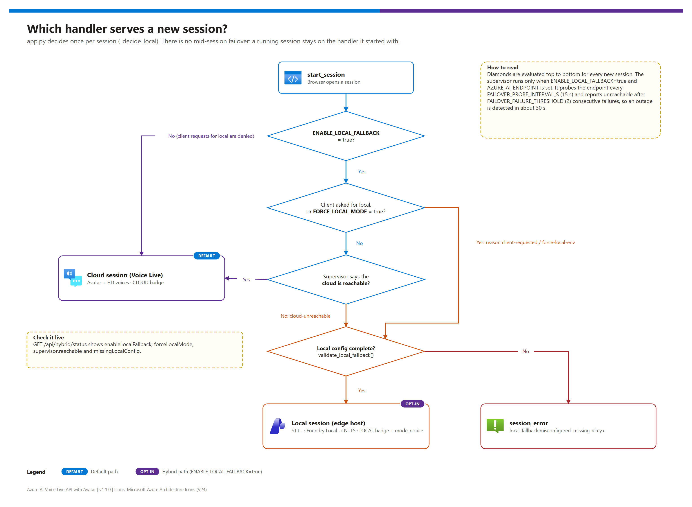
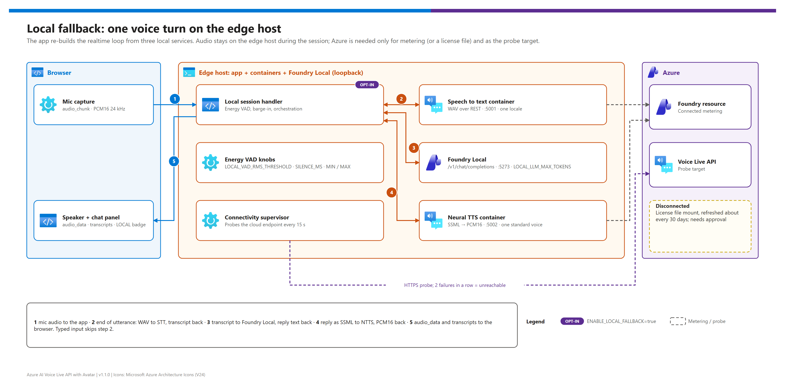

[README](../README.md) › [docs index](./00-reproduce-this-demo.md) › 06 Hybrid local fallback

# 06 — Hybrid local fallback

<p>
&nbsp;
&nbsp;
&nbsp;
&nbsp;

</p>

  

The on-prem half of the pattern, end to end: why it exists, how a session decides between cloud and local, what one local voice turn looks like, what stays in Azure, how the containers are licensed, and which settings tune it. It is written for architects deciding whether sites with unreliable connectivity need it, and for engineers enabling it. The cloud path in [01 — Architecture](./01-architecture.md) is the default; this path is **opt-in** (`ENABLE_LOCAL_FALLBACK=true`) and **voice-only**.

## At a glance

| | Topic | One-line answer |
|---|---|---|
|  | **When it runs** | Per session, when fallback is on and the supervisor says the cloud is unreachable — or local is forced |
|  | **Pipeline** | STT container → Foundry Local (chat completion) → neural TTS container, all on loopback |
|  | **What you lose** | Avatar, HD voices, semantic VAD, function calling; first audio ~2–4 s instead of ~0.5–1 s |
|  | **Licensing** | Connected metering on the Foundry resource, or disconnected (approval + commitment tier) |
|  | **Platforms** | Foundry Local runs on Windows, macOS (Apple silicon) and Linux; vLLM is an alternative |

## Why a fallback

The design chose **Approach A — cloud-primary with an on-prem, voice-only fallback** over a local-first design (B) and cloud with only local tools (C), because it keeps the avatar and HD voices whenever the link is healthy and still keeps a conversation alive when it isn't.

| Approach | Default experience | During an outage | Verdict |
|---|---|---|---|
| **A — cloud-primary + voice-only fallback** | Full avatar + HD voices | Voice-only on the edge host | ✅ **Recommended** — implemented in this repo |
| B — local-first, cloud burst | Voice-only, local quality | Voice-only | Use when data must stay on site for routine turns |
| C — cloud Voice Live + local tools only | Full avatar | ❌ App is down | Doesn't solve the outage problem |

Full analysis: [`hybrid/customer-report.md`](./hybrid/customer-report.md). Engineering plan: [`hybrid/implementation-plan.md`](./hybrid/implementation-plan.md).

## Session routing

[](./assets/session-routing-decision.png)

<sub>Editable source: [`assets/session-routing-decision.drawio`](./assets/session-routing-decision.drawio) — regenerate with `python scripts/export_diagrams.py docs/assets`.</sub>

| Order | Condition (`app.py` `_decide_local`) | Result | `mode_notice` reason |
|---|---|---|---|
| 1 | Client sent `forceMode: "local"` and fallback is on | Local | `client-requested` |
| 2 | `ENABLE_LOCAL_FALLBACK=false` | Cloud (client local requests are denied) | — |
| 3 | `FORCE_LOCAL_MODE=true` | Local | `force-local-env` |
| 4 | Supervisor reports the cloud unreachable | Local | `cloud-unreachable: <last error>` |
| 5 | Otherwise | Cloud | — |
| then | Local chosen but `validate_local_fallback()` lists missing keys | `session_error` | `local-fallback misconfigured: missing …` |

> [!IMPORTANT]
> The decision is made **once per session**. A running cloud session that loses connectivity ends with an error; the user starts a new session, which then opens in local mode. Mid-session failover would need conversation replay and is deliberately out of scope.

## One local voice turn

[](./assets/hybrid-local-pipeline.png)

<sub>Editable source: [`assets/hybrid-local-pipeline.drawio`](./assets/hybrid-local-pipeline.drawio).</sub>

| Step | | What happens | Setting |
|---|---|---|---|
| **1** |  | The browser streams `audio_chunk` (PCM16 24 kHz) over the same WebSocket as cloud mode | — |
| **2** |  | Energy VAD detects the end of the utterance; the handler posts a WAV to the STT container | `LOCAL_VAD_*`, `LOCAL_STT_ENDPOINT`, `LOCAL_STT_LANGUAGE` |
| **3** |  | The transcript goes to Foundry Local `/v1/chat/completions` with `SYSTEM_PROMPT` | `LOCAL_LLM_ENDPOINT`, `LOCAL_LLM_MODEL`, `LOCAL_LLM_MAX_TOKENS`, `LOCAL_LLM_TIMEOUT_S` |
| **4** |  | The reply goes to the neural TTS container as SSML; PCM16 comes back | `LOCAL_TTS_ENDPOINT`, `LOCAL_TTS_VOICE` |
| **5** |  | `audio_data` + transcripts go to the browser; talking over the reply cancels playback | — |

## What stays in Azure

| Component | Cloud mode | Local fallback | Why |
|---|---|---|---|
|  Voice Live API | ✅ | ❌ | Azure-only service |
|  Real-time avatar | ✅ | ❌ | No container or SDK for on-prem rendering |
|  `gpt-realtime` family | ✅ | ❌ → Foundry Local chat model | Speech-in / speech-out models are Azure-only |
|  HD voices | ✅ | ❌ → standard neural voice | Not in the container catalog |
|  Speech to text | ✅ (inside Voice Live) | ✅ STT container | Containerized Azure Speech |
|  Foundry resource | ✅ | ✅ metering / license issuance | Containers bill to it |

Component-by-component detail, egress rules and data flows: [`hybrid/azure-vs-onprem-responsibility.md`](./hybrid/azure-vs-onprem-responsibility.md). Model choices on both sides: [`hybrid/model-selection.md`](./hybrid/model-selection.md).

> [!WARNING]
> **Privacy posture changes between modes.** In local mode no audio leaves the site; in cloud mode audio goes to the Foundry resource and model inference follows the model's scope (global, data zone or regional). The STT container also logs recognized text by default — decide where those logs go ([03 §5.3](./03-deployment.md#53-route-logs-to-your-siem)).

## Container licensing

| | Connected | Disconnected |
|---|---|---|
| **Billing** | Metered on the Foundry resource | Commitment tier |
| **Needs** | Outbound HTTPS to `*.cognitiveservices.azure.com` | Microsoft approval (<https://aka.ms/csdisconnectedcontainers>) + license file mount |
| **Offline tolerance** | Containers need the metering endpoint periodically | Fully offline; refresh the license about every 30 days |
| **Recommendation** | Dev boxes and labs | Sites where the link is genuinely unreliable |

Steps: [03 §5.4](./03-deployment.md#54-switch-container-metering-to-disconnected-offline-tolerant-sites). Reference: [Use containers in disconnected environments](https://learn.microsoft.com/azure/ai-services/containers/disconnected-containers).

## Enable it

| Step | | Action | Where |
|---|---|---|---|
| **1** |  | Size and prepare the edge host | [02 §2](./02-prerequisites.md#2-optional--on-prem-hybrid-fallback-path) |
| **2** |  | Start the STT + NTTS containers | [03 §4.3](./03-deployment.md#43-start-the-speech-containers) |
| **3** |  | Install Foundry Local, download `qwen2.5-7b-instruct` or `phi-4` | [03 §4.4](./03-deployment.md#44-install-foundry-local-and-download-a-model) |
| **4** |  | Set `ENABLE_LOCAL_FALLBACK=true` and the `LOCAL_*` settings | [03 §4.5](./03-deployment.md#45-wire-the-app-to-the-local-stack), [07](./07-configuration-reference.md#hybrid-local-fallback) |
| **5** |  | Run H1–H10 and calibrate VAD | [04 §3](./04-testing.md#3-hybrid-test-matrix-phase-4-only), [04 §5](./04-testing.md#5-vad-tuning-and-acoustic-validation) |

<details><summary><b>Show the minimal .env for the hybrid path</b></summary>

```env
ENABLE_LOCAL_FALLBACK=true
LOCAL_STT_ENDPOINT=http://localhost:5001
LOCAL_TTS_ENDPOINT=http://localhost:5002
LOCAL_TTS_VOICE=en-US-JennyNeural        # must match the NTTS container tag
LOCAL_LLM_ENDPOINT=http://localhost:5273/v1
LOCAL_LLM_MODEL=qwen2.5-7b-instruct      # must match the Foundry Local alias
# FORCE_LOCAL_MODE=true                  # demos / offline development
```

</details>

> [!TIP]
> For a demo, set `FORCE_LOCAL_MODE=true` rather than unplugging the network: it shows the orange `LOCAL` badge immediately, and the supervisor timing (about 30 s to detect an outage) doesn't eat into the run of show.

## Known limitations

| Limitation | Impact | Planned |
|---|---|---|
| No avatar in local mode | Voice-only UX during outages | No on-prem avatar exists |
| No function calling in local mode | Tools such as `get_weather` don't run | v2 |
| Energy VAD | Room-sensitive; needs per-site calibration | — |
| One voice per NTTS image | Extra voices cost about 6 vCPU / 12 GB each | — |
| Per-session decision | A cloud session that drops must be restarted | Mid-session failover is out of scope |

---

Next: [07 — Configuration reference](./07-configuration-reference.md) →

*Last updated: 2026-10-07*
