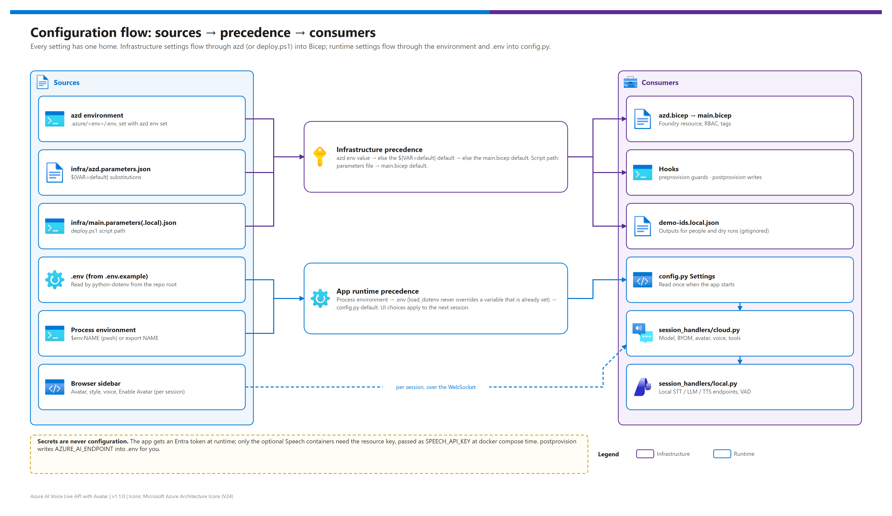

[README](../README.md) › [docs index](./00-reproduce-this-demo.md) › 07 Configuration reference

# 07 — Configuration reference

&nbsp;
&nbsp;
&nbsp;
&nbsp;
&nbsp;

   

Every value you can set, in one page, so nobody has to read code to change a model, region, name, voice or behaviour: where configuration lives and which source wins, the azd environment variables, the Bicep outputs, the script-path parameters, `demo-ids.local.json`, the app's runtime environment variables, and recipes for common changes. `tests/test_configuration.py` fails if a variable, output or setting is added without being documented here.

## At a glance

| | Where it lives | Set it with |
|---|---|---|
|  | **azd environment** (`.azure/<env>/.env`) | `azd env set NAME value` |
|  | **Bicep parameters** (`infra/azd.parameters.json`, `infra/main.parameters(.local).json`) | azd substitutions, or edit the local parameters file for `deploy.ps1` |
|  | **App runtime** (`.env`, process environment) | Edit `.env` (from `.env.example`) or export variables |
|  | **Per session** (browser sidebar) | Avatar, style, voice, Enable Avatar |
|  | **Outputs** (`demo-ids.local.json`) | Written for you after a deployment — not read at runtime |

## Overview

Editable source: [`assets/configuration-flow.drawio`](./assets/configuration-flow.drawio) — regenerate with `python scripts/export_diagrams.py docs/assets`.

| Scope | Precedence (highest first) |
|---|---|
| Infrastructure, azd path | azd environment value → `${VAR=default}` default in `infra/azd.parameters.json` → `main.bicep` default |
| Infrastructure, script path | Parameters file passed to `deploy.ps1` (`-Location` overrides `location`) → `main.bicep` default |
| App runtime | Process environment → `.env` (`load_dotenv` never overrides a variable that is already set) → `config.py` default |
| Per session | Browser sidebar choices → `DEFAULT_*` settings |

> [!NOTE]
> `config.py` reads the environment **once at start-up**. Restart `python app.py` after changing `.env`; sidebar choices apply to the next session without a restart.

## azd environment variables

### Target and identity

| Variable | Default | Effect |
|---|---|---|
| `AZURE_ENV_NAME` | set by `azd env new` | Environment name; tagged as `azd-env-name`; 2–32 lowercase letters, digits, hyphens (hook-enforced) |
| `AZURE_TENANT_ID` | — (required) | Tenant the `preprovision` hook compares with `az account show` |
| `AZURE_SUBSCRIPTION_ID` | — (required) | Subscription the hook compares with `az account show`; azd deploys into it |
| `AZURE_LOCATION` | `eastus2` | Region; must be in the Bicep allow-list; non-Tier-1 regions print a note ([02 §1.3](./02-prerequisites.md#13-regional-availability-matrix)) |
| `AZURE_PRINCIPAL_ID` | set by azd (signed-in principal) | Receives Cognitive Services User + Foundry User |
| `AZURE_PRINCIPAL_TYPE` | `User` | `User`, `ServicePrincipal` or `Group`; applies to every principal below |
| `ADDITIONAL_PRINCIPAL_IDS` | empty | Comma-separated object IDs that also receive the runtime roles (for example the app's managed identity) |

### Naming and platform

| Variable | Default | Effect |
|---|---|---|
| `AZURE_RESOURCE_GROUP` | empty → `rg-<prefix>-<env>-<region>` | Resource group name; azd writes the output back so later runs reuse it |
| `DEMO_ENVIRONMENT` | `dev` | `dev` / `test` / `prod` in names and tags |
| `WORKLOAD_PREFIX` | `avla` | 3–8 lowercase letters/digits, starting with a letter |
| `FOUNDRY_NAME` | empty → `aif-<prefix>-<env>-<region>-<unique>` | Foundry resource name (globally unique); written back as an output |
| `FOUNDRY_SKU` | `S0` | Only S0 is supported |

### Hook behaviour

| Variable | Default | Effect |
|---|---|---|
| `WRITE_DOTENV` | `true` | `postprovision` writes `AZURE_AI_ENDPOINT` into `.env` (seeding it from `.env.example`) |
| `PURGE_SOFT_DELETED` | `false` | `preprovision` purges a soft-deleted Foundry account whose name collides instead of stopping |
| `VOICE_LIVE_MODEL` | `gpt-realtime-2.1` | Only recorded in `demo-ids.local.json` by `postprovision`; the app reads its own `.env` value |

## Outputs

`infra/azd.bicep` outputs (UPPER_SNAKE_CASE, written to `.azure/<env>/.env` and exported to hooks) and where they land:

| Output | Value | `demo-ids.local.json` key |
|---|---|---|
| `AZURE_LOCATION` | Region | `azure.location` |
| `AZURE_RESOURCE_GROUP` | Resource group name | `azure.resourceGroup` |
| `FOUNDRY_NAME` | Foundry resource name | `azure.foundryName` |
| `AZURE_AI_ENDPOINT` | `https://<name>.services.ai.azure.com` (→ `.env`) | `azure.azureAiEndpoint` |
| `COGNITIVE_SERVICES_ENDPOINT` | `https://<name>.cognitiveservices.azure.com/` (→ `SPEECH_BILLING`) | `azure.cognitiveServicesEndpoint` |
| `FOUNDRY_PRINCIPAL_ID` | System-assigned identity object ID (for BYOM grants) | `azure.foundryPrincipalId` |
| `ROLE_ASSIGNMENTS_CREATED` | Number of principals granted the runtime roles | `azure.roleAssignmentsCreated` |

## Script-path parameters

| `deploy.ps1` parameter | Effect | azd equivalent |
|---|---|---|
| `-TenantId` | Required unless `-SkipLogin`; must match `az account show` | `AZURE_TENANT_ID` |
| `-SubscriptionId` | Required unless `-SkipLogin`; passed as `--subscription` | `AZURE_SUBSCRIPTION_ID` |
| `-ParametersFile` | Bicep parameters file (default `infra/main.parameters.json`) | `infra/azd.parameters.json` |
| `-Location` | Overrides `location` from the parameters file | `AZURE_LOCATION` |
| `-DeploymentName` | ARM deployment name (default timestamped) | azd-managed |
| `-WhatIf` | Runs `az deployment sub what-if` only | `azd provision` what-if flag |
| `-WriteEnv` | Writes `AZURE_AI_ENDPOINT` into `.env` | `WRITE_DOTENV=true` |
| `-Verify` | HTTPS reachability + role listing after deploy | — |
| `-SkipLogin` | Skips the tenant/subscription check (CI with federated credentials) | — |

| `main.bicep` parameter | Default | azd variable |
|---|---|---|
| `location` | `eastus2` | `AZURE_LOCATION` |
| `environment` | `dev` | `DEMO_ENVIRONMENT` |
| `workloadPrefix` | `avla` | `WORKLOAD_PREFIX` |
| `resourceGroupNameOverride` | `""` | `AZURE_RESOURCE_GROUP` |
| `foundryNameOverride` | `""` | `FOUNDRY_NAME` |
| `foundrySku` | `S0` | `FOUNDRY_SKU` |
| `appPrincipalObjectIds` | `[]` | `AZURE_PRINCIPAL_ID` + `ADDITIONAL_PRINCIPAL_IDS` |
| `appPrincipalType` | `User` | `AZURE_PRINCIPAL_TYPE` |
| `tags` | workload / environment / managedBy | built in `azd.bicep` (adds `azd-env-name`) |

## demo-ids.local.json

Written by `postprovision` or `deploy.ps1`, gitignored, never read at runtime. Shape: [`demo-ids.template.json`](../demo-ids.template.json).

| Key | Source |
|---|---|
| `generatedBy`, `generatedAt` | Hook or script name; timestamp |
| `azure.tenantId`, `azure.subscriptionId` | `AZURE_TENANT_ID`, `AZURE_SUBSCRIPTION_ID` (or `-TenantId` / `-SubscriptionId`) |
| `azure.location`, `azure.resourceGroup`, `azure.foundryName` | Outputs |
| `azure.azureAiEndpoint`, `azure.cognitiveServicesEndpoint`, `azure.foundryPrincipalId`, `azure.roleAssignmentsCreated` | Outputs |
| `workload.voiceLiveModel`, `workload.azdEnvironment` | `VOICE_LIVE_MODEL`, `AZURE_ENV_NAME` — the single workload block |

## Runtime environment variables

Read by `config.py` from the process environment and `.env` (see [`.env.example`](../.env.example)).

### Voice Live and model

| Variable | Default | Effect |
|---|---|---|
| `AZURE_AI_ENDPOINT` | — (required) | `https://<name>.services.ai.azure.com`; Voice Live endpoint and the supervisor's probe target |
| `VOICE_LIVE_MODEL` | `gpt-realtime-2.1` | Built-in Voice Live model ([`hybrid/model-selection.md`](./hybrid/model-selection.md)) |
| `ENABLE_BYOM_MODE` | `false` | Use your own deployment instead of `VOICE_LIVE_MODEL` |
| `VOICE_BYOM_MODE` | `byom-azure-openai-realtime` | BYOM profile: `…-realtime`, `byom-azure-openai-chat-completion`, `byom-foundry-anthropic-messages`  |
| `VOICE_BYOM_MODEL` | empty | Deployment **name** from the Foundry portal; sent as `model` |
| `VOICE_BYOM_FOUNDRY_RESOURCE_OVERRIDE` | empty | Model's Foundry resource name (no domain) for cross-resource BYOM |

### App and UI

| Variable | Default | Effect |
|---|---|---|
| `PORT` | `8000` | HTTP port for `python app.py` |
| `DEFAULT_VIDEO_CHARACTER` | `lisa` | Pre-selected video avatar (must exist in `AVATAR_CHARACTERS`) |
| `DEFAULT_PHOTO_CHARACTER` | `isabella` | Pre-selected photo avatar (must exist in `PHOTO_AVATARS`) |
| `DEFAULT_VOICE` | `en-US-Ava:DragonHDLatestNeural` | Pre-selected voice (must exist in `VOICES`; HD voices need an HD region) |
| `ENABLE_WEATHER_TOOL` | `false` | Exposes `get_weather` (Open-Meteo, keyless) and extends `SYSTEM_PROMPT` |

### Hybrid local fallback

| Variable | Default | Effect |
|---|---|---|
| `ENABLE_LOCAL_FALLBACK` | `false` | Turns on the supervisor and the local handler ([06](./06-hybrid-local-fallback.md)) |
| `FORCE_LOCAL_MODE` | `false` | Every session uses local mode (demos, offline development) |
| `LOCAL_STT_ENDPOINT` | `http://localhost:5001` | Speech to text container |
| `LOCAL_STT_LANGUAGE` | `en-US` | Must match the STT image's locale |
| `LOCAL_TTS_ENDPOINT` | `http://localhost:5002` | Neural TTS container |
| `LOCAL_TTS_VOICE` | `en-US-JennyNeural` | Must match the NTTS image tag |
| `LOCAL_LLM_ENDPOINT` | `http://localhost:5273/v1` | OpenAI-compatible base URL (Foundry Local or vLLM) |
| `LOCAL_LLM_MODEL` | `qwen2.5-7b-instruct` | Model alias served locally |
| `LOCAL_LLM_API_KEY` | `not-needed` | Placeholder; Foundry Local doesn't authenticate |
| `LOCAL_LLM_TIMEOUT_S` | `30` | Per-request timeout |
| `LOCAL_LLM_MAX_TOKENS` | `256` | Reply length cap (lower = snappier) |
| `FAILOVER_PROBE_INTERVAL_S` | `15` | Seconds between reachability probes |
| `FAILOVER_PROBE_TIMEOUT_S` | `3` | Probe timeout |
| `FAILOVER_FAILURE_THRESHOLD` | `2` | Consecutive failures before "unreachable" |
| `LOCAL_VAD_SILENCE_MS` | `700` | Silence that ends an utterance |
| `LOCAL_VAD_RMS_THRESHOLD` | `350` | Energy threshold for speech ([04 §5](./04-testing.md#5-vad-tuning-and-acoustic-validation)) |
| `LOCAL_VAD_MIN_SPEECH_MS` | `250` | Ignores clicks shorter than this |
| `LOCAL_VAD_MAX_UTTERANCE_MS` | `20000` | Hard cap on one utterance |

### Containers and tooling

| Variable | Read by | Effect |
|---|---|---|
| `SPEECH_BILLING` | `docker-compose.local.yml` | Foundry Cognitive Services endpoint for container metering (`COGNITIVE_SERVICES_ENDPOINT`) |
| `SPEECH_API_KEY` | `docker-compose.local.yml` | Foundry resource key — a **secret**; keep it in a site secret store |
| `DRAWIO_EXE` | `scripts/export_diagrams.py` | Path to the draw.io desktop CLI when it isn't found automatically |

## Recipes

| Goal | Change |
|---|---|
| Deploy to Sweden Central | `azd env set AZURE_LOCATION swedencentral` → `azd up` |
| Give the app's managed identity the runtime roles | `azd env set ADDITIONAL_PRINCIPAL_IDS <object-id>` → `azd provision` |
| Keep `.env` untouched by azd | `azd env set WRITE_DOTENV false` |
| Cheaper model | `.env`: `VOICE_LIVE_MODEL=gpt-realtime-2.1-mini` |
| Keep inference in the data zone | `.env`: `VOICE_LIVE_MODEL=gpt-realtime-2.1-datazone` (check the region offers it) |
| Use your own realtime deployment | `.env`: `ENABLE_BYOM_MODE=true`, `VOICE_BYOM_MODE=byom-azure-openai-realtime`, `VOICE_BYOM_MODEL=<deployment-name>` |
| Different default avatar / voice | `.env`: `DEFAULT_VIDEO_CHARACTER=max`, `DEFAULT_VOICE=en-US-Andrew:DragonHDLatestNeural` |
| Change the persona | Edit `SYSTEM_PROMPT` in `config.py` |
| Demo the local fallback on stage | `.env`: `ENABLE_LOCAL_FALLBACK=true`, `FORCE_LOCAL_MODE=true` |

> [!CAUTION]
> **Secrets are never configuration.** The app authenticates with Entra ID (`DefaultAzureCredential`); no key belongs in `.env` for the cloud path. The only secret in the pattern is the optional `SPEECH_API_KEY` for the containers. Never commit `.env`, `.azure/` or `demo-ids.local.json` — `.gitignore` excludes them.

---

Next: back to the [README](../README.md) →

*Last updated: 2026-10-07*
