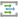

# Icons

Official Microsoft architecture icons used by these docs and diagrams.

| Set | Source |
|---|---|
| Azure Architecture Icons (V24, July 2026) | https://learn.microsoft.com/en-us/azure/architecture/icons/ |
| Microsoft Entra architecture icons (Oct 2023) | https://learn.microsoft.com/en-us/entra/architecture/architecture-icons |

> Microsoft permits use of these icons in architecture diagrams, training materials and documentation. Don't crop, flip, rotate, recolor or distort them; keep the product name next to the icon.

| Icon | Key | Product | Source file |
|---|---|---|---|
|  | `activity-log` | Activity log | `00007-icon-service-Activity-Log.svg` |
|  | `ai-gateway` | AI Gateway | `037838045-icon-service-AI-Gateway.svg` |
|  | `ai-search` | Azure AI Search | `10044-icon-service-Cognitive-Search.svg` |
|  | `aks` | Azure Kubernetes Service | `10023-icon-service-Kubernetes-Services.svg` |
|  | `alerts` | Alerts | `00002-icon-service-Alerts.svg` |
|  | `api-center` | API Center | `03291-icon-service-API-Center.svg` |
|  | `api-management` | API Management | `10042-icon-service-API-Management-Services.svg` |
|  | `app-registrations` | App registrations | `10232-icon-service-App-Registrations.svg` |
|  | `app-service` | App Service | `10035-icon-service-App-Services.svg` |
|  | `application-gateway` | Application Gateway | `10076-icon-service-Application-Gateways.svg` |
|  | `application-insights` | Application Insights | `00012-icon-service-Application-Insights.svg` |
|  | `azure-devops` | Azure DevOps | `10261-icon-service-Azure-DevOps.svg` |
|  | `azure-openai` | Azure OpenAI | `03438-icon-service-Azure-OpenAI.svg` |
|  | `blob-block` | Blob Block | `10780-icon-service-Blob-Block.svg` |
|  | `code` | Code (generic) | `10787-icon-service-Code.svg` |
|  | `commit` | Commit | `10788-icon-service-Commit.svg` |
|  | `communication-services` | Communication Services | `00968-icon-service-Azure-Communication-Services.svg` |
|  | `container-apps` | Container Apps | `02884-icon-service-Worker-Container-App.svg` |
|  | `container-apps-environment` | Container Apps environment | `02989-icon-service-Container-Apps-Environments.svg` |
|  | `container-registry` | Container Registry | `10105-icon-service-Container-Registries.svg` |
|  | `content-safety` | Content Safety | `03390-icon-service-Content-Safety.svg` |
|  | `cosmos-db` | Cosmos DB | `10121-icon-service-Azure-Cosmos-DB.svg` |
|  | `cost-alerts` | Cost alerts | `10791-icon-service-Cost-Alerts.svg` |
|  | `cost-management` | Cost Management | `10019-icon-service-Cost-Management.svg` |
|  | `data-factory` | Data Factory | `10126-icon-service-Data-Factories.svg` |
|  | `defender-for-cloud` | Defender for Cloud | `10241-icon-service-Microsoft-Defender-for-Cloud.svg` |
|  | `dev-console` | Dev Console | `10796-icon-service-Dev-Console.svg` |
|  | `diagnostic-settings` | Diagnostic settings | `00008-icon-service-Diagnostics-Settings.svg` |
|  | `dns-zones` | DNS zones | `10064-icon-service-DNS-Zones.svg` |
|  | `document-intelligence` | Document Intelligence | `00819-icon-service-Form-Recognizers.svg` |
|  | `download` | Download | `10797-icon-service-Download.svg` |
|  | `enterprise-applications` | Enterprise applications | `10225-icon-service-Enterprise-Applications.svg` |
|  | `entra-id` | Microsoft Entra ID | `Microsoft Entra ID color icon.svg` |
|  | `entra-id-governance` | Microsoft Entra ID Governance | `Microsoft Entra ID Governance color icon.svg` |
|  | `entra-id-protection` | Entra ID Protection | `10231-icon-service-Entra-ID-Protection.svg` |
|  | `entra-roles` | Entra roles and administrators | `10340-icon-service-Entra-Identity-Roles-and-Administrators.svg` |
|  | `entra-workload-id` | Microsoft Entra Workload ID | `Microsoft Entra Workload ID color icon.svg` |
|  | `event-grid` | Event Grid | `10206-icon-service-Event-Grid-Topics.svg` |
|  | `event-hubs` | Event Hubs | `00039-icon-service-Event-Hubs.svg` |
|  | `file` | File | `10800-icon-service-File.svg` |
|  | `firewall` | Azure Firewall | `10084-icon-service-Firewalls.svg` |
|  | `folder` | Folder Blank | `10802-icon-service-Folder-Blank.svg` |
|  | `foundry` | Microsoft Foundry | `035746832-icon-service-AI-Foundry.svg` |
|  | `foundry-agent-service` | Foundry Agent Service | `038470523-icon-service-Foundry-Agent-Service.svg` |
|  | `foundry-control-plane` | Foundry Control Plane | `038470534-icon-service-Foundry-Control-Plane.svg` |
|  | `foundry-models` | Foundry Models | `038470614-icon-service-Foundry-Models.svg` |
|  | `foundry-project` | Foundry project | `036509415-icon-service-Foundry-Project.svg` |
|  | `front-door` | Front Door | `10073-icon-service-Front-Door-and-CDN-Profiles.svg` |
|  | `functions` | Azure Functions | `10029-icon-service-Function-Apps.svg` |
|  | `gear` | Gear | `10805-icon-service-Gear.svg` |
|  | `key-vault` | Key Vault | `10245-icon-service-Key-Vaults.svg` |
|  | `keys` | Keys | `00787-icon-service-Keys.svg` |
|  | `log-analytics` | Log Analytics workspace | `00009-icon-service-Log-Analytics-Workspaces.svg` |
|  | `logic-apps` | Logic Apps | `02631-icon-service-Logic-Apps.svg` |
|  | `machine-learning` | Azure Machine Learning | `10166-icon-service-Machine-Learning.svg` |
|  | `managed-identity` | Managed identity | `10227-icon-service-Managed-Identities.svg` |
|  | `media-file` | Media File | `10821-icon-service-Media-File.svg` |
|  | `monitor` | Azure Monitor | `00001-icon-service-Monitor.svg` |
|  | `nsg` | Network security group | `10067-icon-service-Network-Security-Groups.svg` |
|  | `policy` | Azure Policy | `10316-icon-service-Policy.svg` |
|  | `powershell` | Powershell | `10825-icon-service-Powershell.svg` |
|  | `private-endpoint` | Private endpoint | `02579-icon-service-Private-Endpoints.svg` |
|  | `private-link` | Private Link | `00427-icon-service-Private-Link.svg` |
|  | `query-pack` | Log Analytics query pack | `01085-icon-service-Log-Analytics-Query-Pack.svg` |
|  | `resource-group` | Resource group | `10007-icon-service-Resource-Groups.svg` |
|  | `sentinel` | Microsoft Sentinel | `10248-icon-service-Azure-Sentinel.svg` |
|  | `service-bus` | Service Bus | `10836-icon-service-Azure-Service-Bus.svg` |
|  | `speech` | Speech | `00797-icon-service-Speech-Services.svg` |
|  | `sql-database` | SQL Database | `10130-icon-service-SQL-Database.svg` |
|  | `storage` | Storage account | `10086-icon-service-Storage-Accounts.svg` |
|  | `subscription` | Subscription | `10002-icon-service-Subscriptions.svg` |
|  | `toolbox` | Toolbox (generic tools) | `10844-icon-service-Toolbox.svg` |
|  | `users` | Users | `10230-icon-service-Users.svg` |
|  | `virtual-network` | Virtual network | `10061-icon-service-Virtual-Networks.svg` |
|  | `workbooks` | Azure Workbooks | `02189-icon-service-Azure-Workbooks.svg` |
