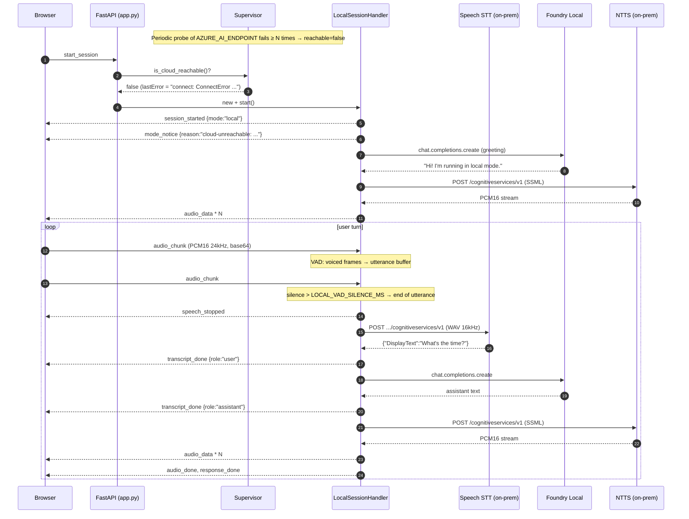

# 01 — Hybrid architecture

> Audience: engineers and architects who will deploy, operate, or extend the
> hybrid local-fallback path. Read after [`00-customer-report.md`](./00-customer-report.md)
> and before [`02-prerequisites.md`](./02-prerequisites.md).

---

## 1. Design intent

Implement **Approach A** from the customer report:

- **Primary path:** unchanged. Browser ↔ FastAPI ↔ Azure AI Voice Live ↔ Azure Avatar Service (WebRTC). Full avatar, HD voices, semantic VAD, function calling.
- **Fallback path:** when the cloud endpoint cannot be reached, the next session is served by an entirely on-prem pipeline (Speech STT container + Foundry Local LLM + Speech NTTS container). Voice-only. Standard neural voice. Energy-based VAD.
- **Switch granularity:** **per session**. Mid-session failover is out of scope (see [IMPLEMENTATION-PLAN.md §1](./IMPLEMENTATION-PLAN.md#1-mvp-scope)).
- **Browser protocol is unchanged.** A new `mode` field on `session_started` and a new optional `mode_notice` message let the UI render a CLOUD/LOCAL badge and a fallback banner; everything else is the same.

---

## 2. Component diagram

```mermaid
flowchart LR
    subgraph Browser["🟦 Browser"]
        UI[index.html + app.js]
        MIC[(Mic — PCM16 24kHz)]
        SPK[(Speaker / Audio playback)]
        VID[(Avatar video — cloud only)]
    end

    subgraph App["🟪 FastAPI app (app.py)"]
        WS[/ws/voicelive WebSocket router]
        SUP[ConnectivitySupervisor]
        ROUTE{{Per-session mode decision}}
        CLOUD[CloudVoiceLiveSessionHandler]
        LOCAL[LocalSessionHandler]
    end

    subgraph Cloud["☁️ Azure"]
        VL[Azure Voice Live API]
        AV[Azure Avatar Service / WebRTC]
    end

    subgraph OnPrem["🏭 On-prem edge box"]
        STT[Speech-to-Text container]
        TTS[Neural-TTS container]
        LLM[Foundry Local LLM]
    end

    UI --> WS
    MIC --> WS
    WS <--> ROUTE
    ROUTE -.->|reachable| CLOUD
    ROUTE -.->|unreachable / forced| LOCAL
    SUP -- "is_cloud_reachable()" --> ROUTE
    SUP -. "periodic HTTPS probe" .-> VL

    CLOUD <-->|"WebSocket (Voice Live SDK)"| VL
    VL -. "ICE / WebRTC SDP" .-> AV
    AV <-. "WebRTC video+audio" .-> VID

    LOCAL -->|"WAV"| STT
    LOCAL -->|"chat/completions"| LLM
    LOCAL -->|"SSML"| TTS
    LOCAL -.->|"PCM16 audio_data frames"| SPK
    CLOUD -.->|"PCM16 audio_data (voice-only)"| SPK
```

### Key responsibilities

| Component | File | Responsibility |
|---|---|---|
| **ConnectivitySupervisor** | `connectivity.py` | Periodic HTTPS probe against `AZURE_AI_ENDPOINT`. Flips state after `FAILOVER_FAILURE_THRESHOLD` consecutive failures. |
| **SessionHandler protocol** | `session_handlers/base.py` | Contract both handlers satisfy. Lets the WS router stay handler-agnostic. |
| **CloudVoiceLiveSessionHandler** | `session_handlers/cloud.py` | Unchanged from `main` — wraps the Voice Live SDK + optional avatar. Adds `"mode": "cloud"` to `session_started`. |
| **LocalSessionHandler** | `session_handlers/local.py` | Owns the local STT → LLM → TTS loop. Implements an energy-based VAD over inbound PCM16 chunks. Emits the same browser event protocol as cloud (minus avatar events). |
| **Local clients** | `local_clients/{stt,tts,llm}.py` | Thin async wrappers around the container REST endpoints and Foundry Local's OpenAI-compatible API. |
| **Routing** | `app.py` → `_decide_local()` | Per-session choice based on `ENABLE_LOCAL_FALLBACK`, `FORCE_LOCAL_MODE`, the supervisor, and an optional client-side `forceMode` config. |

---

## 3. Sequence — happy-path local fallback



---

## 4. Trust boundaries

| Boundary | Notes |
|---|---|
| Browser ↔ FastAPI | Same as today. WebSocket only. No browser-side knowledge of which mode is in use until `session_started` arrives. |
| FastAPI ↔ Azure | Same as today. `DefaultAzureCredential` + Voice Live SDK. |
| FastAPI ↔ On-prem containers | **New.** Plain HTTP on the site LAN by default. The Speech containers terminate TLS only if configured with a cert mount. **Recommendation:** run all three components on the same host (loopback only) or front them with a reverse proxy that adds mTLS. |
| FastAPI ↔ Foundry Local | Same host typically (loopback). Foundry Local does not authenticate. |
| On-prem containers ↔ Azure (metering) | Required for **connected** containers. For **disconnected** the licensing dance replaces this. |

---

## 5. Failure modes

| Scenario | Behaviour |
|---|---|
| Cloud reachable, all good | `session_started {mode:"cloud"}`. Avatar pane visible if `Enable Avatar` was checked. |
| Cloud reachable but the Voice Live handshake fails (auth, quota) | Cloud handler emits `session_error`. We do NOT auto-retry into local mode for this session — error surfaces to the user. The next session is attempted cloud again (supervisor still says reachable). |
| Cloud unreachable at session start | Local handler is used. UI shows the orange `LOCAL` badge + banner with the supervisor's `lastError`. |
| Cloud comes back during a local session | The current session keeps running locally. The next session starts in cloud mode automatically. |
| Cloud reachable but `FORCE_LOCAL_MODE=true` | Local handler is used. Banner reads `(force-local-env)`. |
| Local stack unreachable while in local mode | `error` message surfaces to the UI; the in-flight turn fails. User can retry. |
| Both cloud and local misconfigured | `session_error` with a list of missing env vars from `validate_local_fallback()`. |

---

## 6. What changes vs `main`

| Area | Change | Risk |
|---|---|---|
| `app.py` | Adds supervisor + routing. Cloud session start path is functionally identical to `main`. | Low — gated on `ENABLE_LOCAL_FALLBACK`. |
| `voice_handler.py` | Becomes a 1-line back-compat re-export. | None. |
| Browser event protocol | One new field (`mode`) and one new message (`mode_notice`). Both additive. | None. |
| Front-end JS | Adds badge / banner; avatar pane is hidden in local mode (`currentMode === "local"`). | Low. |
| New deps | `openai>=1.50` for Foundry Local client. | Low. |

---

*See [IMPLEMENTATION-PLAN.md](./IMPLEMENTATION-PLAN.md) for the file map, milestones, and explicit out-of-scope items.*
